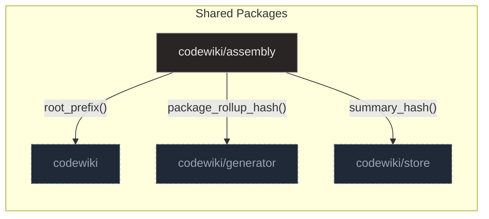

# Assembly

## Purpose and Scope

The `codewiki/assembly` package orchestrates the creation of static documentation by combining taxonomy definitions with runtime graph data. This workflow begins with `scaffold.py` or `pages.py` establishing the site structure and page specifications, which are then processed by `render.py` to generate content via Jinja2 templating. Simultaneously, `diagrams.py` extracts structural and channel edges from the database to produce faithful Mermaid visualizations.

The system prioritizes deterministic output and avoids LLMs, ensuring documentation remains synchronized with the source code without invented edges. The `assemble` function in `render.py` serves as the primary entry point for assembly tasks, orchestrating the full documentation generation pipeline. It loads page specifications, renders each page via `build_page`, and collects metadata, conditionally writing the generated markdown content and a JSON manifest to the wiki directory.

`PageSpec` in `pages.py` serves as a structured configuration record for generating documentation pages. It encapsulates essential metadata such as the page slug, title, and sort order. The class also manages content filtering through include prefixes and domain node kinds, allowing precise control over rendered elements. Additionally, it supports a testing mode via the `keep_tests` flag to adjust how test files are prioritized.

**Sources:**
- [pages.py:20-27](https://github.com/doxiebuilds/codewiki/blob/main/codewiki/assembly/pages.py#L20-L27)
- [render.py:264-289](https://github.com/doxiebuilds/codewiki/blob/main/codewiki/assembly/render.py#L264-L289)

---

## Architecture

The assembly engine is structured around three primary modules that handle diagram generation, static content rendering, and site scaffolding. These components work in concert to transform raw code graph data into a structured, deterministic documentation site. The high-level interaction between these modules and shared packages is illustrated below.

### diagrams.py

The `diagrams.py` module serves as the core engine for visualizing the system's architecture by converting code graph data into faithful Mermaid flowcharts. It operates by resolving imports, classifying packages into defined layers, and extracting both structural (import/call) and channel (publish/consume) edges from the database. The module then constructs the diagram by grouping nodes into layered subgraphs, applying specific CSS classes, and filtering out noise like test packages or generic method names. This ensures the output is a clean, deterministic representation of the real code dependencies without invented edges.

### render.py

The `render.py` module serves as the core assembly engine for generating static wiki documentation from a code graph database. It operates by iterating through page specifications, fetching relevant package metadata, module lists, key symbols, and domain-specific tables, then formatting these elements into structured Markdown. The system ensures deterministic output by computing page hashes to manage caching and employs a hybrid approach for page overviews, attempting LLM generation before falling back to stitched summaries of top packages. Finally, it renders the aggregated data through Jinja2 templates to produce the final documentation artifacts.

### scaffold.py

The `scaffold.py` module serves as the core logic for the `codewiki init` command, transforming raw symbol data into a structured site map. It begins by querying the database for package statistics, then uses helper functions to group these packages hierarchically and filter for significance based on symbol counts. It normalizes identifiers and determines domain ownership to attach metadata to the proposed pages. Finally, it renders the collected information into a YAML configuration file that defines the initial navigation structure, including an overview page and separate sections for tests if applicable.

**Sources:**
- [diagrams.py:1-355](https://github.com/doxiebuilds/codewiki/blob/main/codewiki/assembly/diagrams.py#L1-L355)
- [render.py:1-290](https://github.com/doxiebuilds/codewiki/blob/main/codewiki/assembly/render.py#L1-L290)
- [scaffold.py:1-179](https://github.com/doxiebuilds/codewiki/blob/main/codewiki/assembly/scaffold.py#L1-L179)

---

## Initialization and Configuration

### load_pages

The `load_pages` function in `pages.py` serves as the central data loading mechanism for page metadata within the system. It initializes the application's configuration by reading a YAML file, prioritizing a repository-specific `pages.yaml` over a bundled default.

The function parses the file and converts its contents into structured `PageSpec` objects, extracting fields such as `slug`, `title`, `order`, `include`, `domain`, and `keep_tests`. It handles defaults for optional fields like `order` and `include` lists, then sorts the resulting list by the `order` field to ensure consistent page ordering.

- **Configuration Priority**: The system looks for a repository-specific `pages.yaml` first, falling back to a bundled default if none is found.
- **Metadata Extraction**: Fields like `slug`, `title`, and `order` are mapped into `PageSpec` objects that encapsulate content filtering rules.
- **Consistent Ordering**: The final list of pages is sorted by the `order` field, providing a stable structure for build, render, and write modules.

### render_yaml

The `render_yaml` function in `scaffold.py` constructs a YAML configuration file by manually appending formatted strings to a list. This approach ensures that explanatory headers and specific key orders are preserved as intended, which is critical for the generated file's readability and subsequent processing.

It iterates through a provided list of pages, extracting fields like `slug`, `title`, `order`, and optional attributes to build the structure. This method allows for precise control over the output format and is tested for round-trip consistency with the loader.

- **Manual Construction**: The function builds the YAML string manually to preserve specific key orders and explanatory headers.
- **Field Extraction**: It iterates through pages to extract `slug`, `title`, `order`, and optional attributes like `keep_tests` and `domain`.
- **Round-Trip Consistency**: The generated configuration is tested to ensure it can be correctly parsed back by the loader.

### propose

The `propose` function in `scaffold.py` generates the initial navigation structure by querying package counts and grouping them into logical domains. It is called by the initialization command in `build.py` to set up the site's starting state.

The function creates an 'Overview' page for top-level roots and individual pages for sub-packages, ensuring unique slugs and attaching domain metadata where applicable. If tests are present in the database, it appends a 'Testing' page to the navigation.

- **Navigation Generation**: Queries package counts to group packages into logical domains for the initial site structure.
- **Page Creation**: Creates an 'Overview' page for top-level roots and individual pages for sub-packages with unique slugs.
- **Test Integration**: Automatically appends a 'Testing' page if tests are detected in the database.

**Sources:**
- [pages.py:1-45](https://github.com/doxiebuilds/codewiki/blob/main/codewiki/assembly/pages.py#L1-L45)
- [pages.py:35-44](https://github.com/doxiebuilds/codewiki/blob/main/codewiki/assembly/pages.py#L35-L44)
- [scaffold.py:112-150](https://github.com/doxiebuilds/codewiki/blob/main/codewiki/assembly/scaffold.py#L112-L150)
- [scaffold.py:153-178](https://github.com/doxiebuilds/codewiki/blob/main/codewiki/assembly/scaffold.py#L153-L178)

---

## Data Retrieval and Symbol Resolution

### _key_symbols
The `_key_symbols` function queries the SQLite database to fetch symbol metadata, including name, kind, qualname, signature, and location, for classes and functions within a specified package. It processes each row to construct a structured dictionary containing a markdown-formatted signature and summary, utilizing helper functions for formatting. This curated view of a package's primary API elements serves as a data source for the `build_page` function, which assembles the final documentation page.

### _modules
The `_modules` function queries the database for symbols of kind 'module' within a specific package, joining with file and summary tables to retrieve file paths and associated summary JSON. It iterates through the results, processing each summary using `_summary_text` and formatting it via `_md_cell` before appending the structured data to the output list. Called by `build_page`, this function provides the module-level metadata required for rendering package overview pages, ensuring that each module entry includes a concise, formatted summary or a placeholder if none exists.

### package_counts
The `package_counts` function queries the 'symbols' table to aggregate the count of symbols grouped by their package path, filtering out entries where the package is null or empty. It explicitly excludes test packages by applying the `is_test_path` filter, as these are handled separately in the documentation structure. Called by `propose` and `_explain_zero_pages`, it provides the necessary statistics to determine package significance and identify packages with zero pages.

### _domain_table
The `_domain_table` function retrieves rows from the 'domain_nodes' table filtered by a specific 'kind' and optionally by file path prefixes. It then dispatches to kind-specific logic to parse JSON details and construct a Markdown table string, handling various domain types such as services, routes, database tables, Redis channels, WebSocket events, FFI exports, API calls, and environment flags. It serves as a core rendering helper for callers like `build_page` and `build_bundle`, which rely on it to generate comprehensive documentation sections for different aspects of the application's architecture.

### _domain_owner
The `_domain_owner` function queries the 'domain_nodes' table to count occurrences of each 'kind' associated with specific file path prefixes. It iterates through the results, incrementing counters for prefixes that match or are parent directories of the node paths. The function returns a dictionary mapping each kind to the prefix that has the most associated nodes, serving as a helper for the 'propose' function to determine domain ownership.

**Sources:**
- [render.py:108-183](https://github.com/doxiebuilds/codewiki/blob/main/codewiki/assembly/render.py#L108-L183)
- [render.py:79-90](https://github.com/doxiebuilds/codewiki/blob/main/codewiki/assembly/render.py#L79-L90)
- [render.py:93-105](https://github.com/doxiebuilds/codewiki/blob/main/codewiki/assembly/render.py#L93-L105)
- [scaffold.py:29-37](https://github.com/doxiebuilds/codewiki/blob/main/codewiki/assembly/scaffold.py#L29-L37)
- [scaffold.py:93-101](https://github.com/doxiebuilds/codewiki/blob/main/codewiki/assembly/scaffold.py#L93-L101)

---

## Page Assembly and Rendering

### build_page
The `build_page` function in `render.py` orchestrates the creation of a documentation page by querying the database for relevant packages and computing a deterministic page hash. It iterates through the packages to construct sections containing module lists, summaries, and key symbols, while also generating domain tables and a Mermaid dependency diagram. The collected data is then rendered via a Jinja2 template to produce the final Markdown content. This function is called by `assemble` and `_fallback` to generate page content and is tested in `test_assemble.py` to verify citation resolution.

### _overview
The `_overview` function constructs a high-level description of a page by first attempting to use an LLM via `chat_fn` to generate a summary from a block of package information. It checks if the current `page_hash` differs from the stored `summary_hash` to avoid redundant LLM calls, and upon success, persists the result using `db.upsert_summary`. If LLM generation fails or is unavailable, it falls back to a deterministic approach that stitches together the summaries of the top three packages. This function is called by `build_page` to provide the initial context for rendered pages.

### _summary_text
The `_summary_text` utility parses a JSON string to extract a human-readable summary or purpose description, prioritizing the `summary` key over `purpose`. It handles malformed JSON and missing keys gracefully by returning an empty string. This function is used by multiple rendering functions (`_pkg_summary`, `_modules`, `_key_symbols`, `_overview`) and the bundle builder (`build_bundle`) to generate concise textual descriptions for various code artifacts.

### _first_sentence
The `_first_sentence` utility normalizes whitespace in the input text and attempts to truncate it at the first period followed by a space. If no such delimiter is found, it returns the entire normalized text, or slices it to the specified limit and appends an ellipsis if it exceeds that length. This function is used by `build_page`, `_manifest_entry`, and `write_quickstart` to generate concise text previews or summaries.

### resolve_import_to_package
The `resolve_import_to_package` function in `diagrams.py` maps a dotted import identifier to an internal package directory by constructing candidate paths and checking them against a known set of packages. It first validates the input format using a regex, then generates candidates by prepending a root prefix and replacing dots with slashes. It iterates from the longest possible path to the shortest to find the most specific match within `all_packages`. This function is called by `_structural_edges` to determine dependency relationships between internal packages.

**Sources:**
- [render.py:228-261](https://github.com/doxiebuilds/codewiki/blob/main/codewiki/assembly/render.py#L228-L261)
- [render.py:193-225](https://github.com/doxiebuilds/codewiki/blob/main/codewiki/assembly/render.py#L193-L225)
- [render.py:46-53](https://github.com/doxiebuilds/codewiki/blob/main/codewiki/assembly/render.py#L46-L53)
- [render.py:56-60](https://github.com/doxiebuilds/codewiki/blob/main/codewiki/assembly/render.py#L56-L60)
- [diagrams.py:113-126](https://github.com/doxiebuilds/codewiki/blob/main/codewiki/assembly/diagrams.py#L113-L126)

---

## Diagram Generation

The system constructs layered architecture and flow diagrams using Mermaid by querying the database for structural edges and Redis channel connections. It filters and ranks nodes to ensure readability while maintaining coverage of all architectural layers.

### package_dependency_mermaid

The `package_dependency_mermaid` function orchestrates the creation of these diagrams by combining structural and channel data. It explicitly excludes test packages when `include_tests=False` to prevent test scaffolding from dominating the view of non-test pages. The function is called by `build_page` and `build_bundle` to generate visual representations of system structure.

### _emit

The `_emit` function serves as the core rendering engine, constructing a Mermaid flowchart by grouping nodes into subgraphs based on their assigned layers. It appends edge definitions between nodes, followed by class definitions and class assignments derived from the node class mapping. This function is verified by `test_emit_is_flowchart_with_subgraphs_and_classes`.

### _structural_edges

The `_structural_edges` function builds a structural dependency graph by querying the database for import edges and resolved call edges. It filters out generic method names to avoid fabricating misleading arrows, while preserving cross-boundary edges to trace data flow accurately. This logic provides the core edge set used in Mermaid diagram generation.

### _channel_edges

The `_channel_edges` function executes a SQL query to find all distinct edges of kind 'publishes' or 'consumes' where the source symbol belongs to the provided packages. It filters out null or empty destination names and deduplicates results before returning them as a list of tuples. This provides the edge data necessary for generating Mermaid diagrams of package dependencies.

### _classdefs

The `_classdefs` function constructs visual styling definitions for a Mermaid diagram by iterating through layer metadata. It assigns color palettes to standard layers and appends hardcoded definitions for 'support', 'infra', and 'boundary' classes. Called by `_emit`, it provides the necessary style rules to render the diagram's classes with appropriate colors and borders.

**Sources:**
- [diagrams.py:258-354](https://github.com/doxiebuilds/codewiki/blob/main/codewiki/assembly/diagrams.py#L258-L354)
- [diagrams.py:216-255](https://github.com/doxiebuilds/codewiki/blob/main/codewiki/assembly/diagrams.py#L216-L255)
- [diagrams.py:156-192](https://github.com/doxiebuilds/codewiki/blob/main/codewiki/assembly/diagrams.py#L156-L192)
- [diagrams.py:195-212](https://github.com/doxiebuilds/codewiki/blob/main/codewiki/assembly/diagrams.py#L195-L212)
- [diagrams.py:95-102](https://github.com/doxiebuilds/codewiki/blob/main/codewiki/assembly/diagrams.py#L95-L102)

---

## Where to Start & Watch-Outs

New developers should begin by examining `scaffold.py`, which implements the `codewiki init` command to transform raw symbol data into a structured site map. This module queries the database for package statistics, groups them hierarchically, and renders the initial navigation structure into a YAML configuration file.

The `propose` function within this module is critical for understanding how page specifications are generated. It filters packages based on significance and domain ownership, ensuring that the overview page covers root packages verbatim while creating separate sections for other groups. If test packages are detected, it also appends a dedicated testing section to the proposed pages.

- `scaffold.py`
- `scaffold.py`

**Sources:**
- [scaffold.py:1-179](https://github.com/doxiebuilds/codewiki/blob/main/codewiki/assembly/scaffold.py#L1-L179)
- [scaffold.py:112-150](https://github.com/doxiebuilds/codewiki/blob/main/codewiki/assembly/scaffold.py#L112-L150)