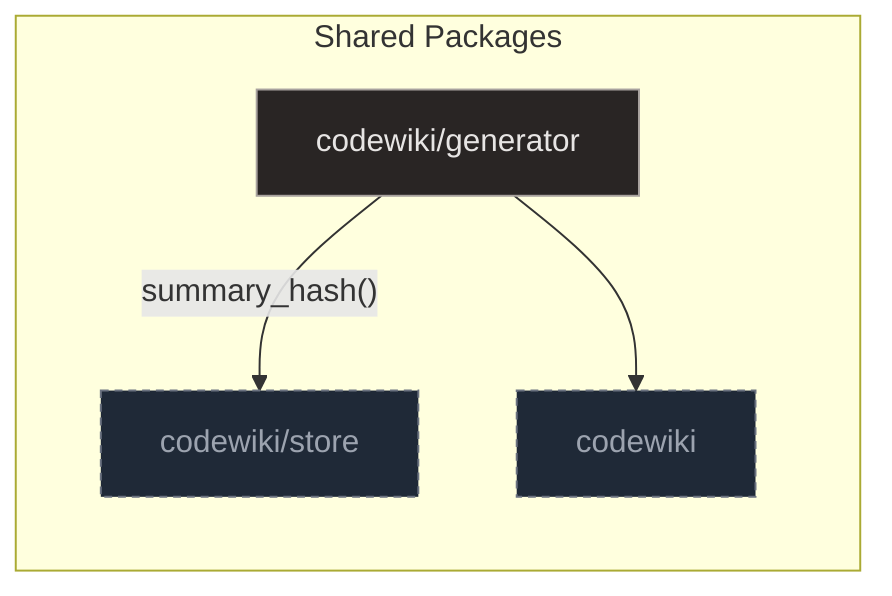

# Generator

## Purpose and Scope

The `codewiki/generator` package serves as the central orchestrator for code generation, specifically focusing on hierarchical summarization while isolating AI-dependent logic. It manages the workflow by assembling deterministic context from static and dynamic code relationships, which feeds into a core engine that processes symbols from leaves up to containers.

This system employs hash-gating to ensure idempotency and concurrency controls during LLM calls, while a calibration module validates the process using representative samples. Together, these components build a consistent, multi-level knowledge base of code documentation.

The `SummaryStats` class in `summarize.py` acts as a lightweight accumulator for monitoring the performance and outcomes of this summarization workflow. It uses a dataclass structure to maintain simple integer counters for generated, skipped, and failed items, alongside token usage metrics for input and output.

Additionally, it maintains a dictionary to break down statistics by specific categories, allowing for granular analysis of the summarization results. This structure provides a centralized view of the system's operational health and resource consumption.

**Sources:**
- [summarize.py:68-75](https://github.com/doxiebuilds/codewiki/blob/main/codewiki/generator/summarize.py#L68-L75)

---

## Architecture

The generator package is structured into three primary modules that isolate orchestration, context assembly, and model tuning. This modular design ensures that deterministic inputs are prepared before interacting with the LLM, while concurrency controls and hash-gating maintain idempotency during the summarization process.



`summarize.py` acts as the core engine, processing symbols from leaf nodes up to containers to build a multi-level knowledge base. It constructs specific prompts for each node type, executes LLM calls with concurrency limits, and validates outputs before storage.

`context.py` serves as the deterministic context assembler, distinguishing between leaf nodes and container nodes to provide rich, self-contained descriptions. It combines static metadata like signatures with dynamic relationship data, prioritizing pre-computed child summaries for containers to optimize token usage.

`calibrate.py` facilitates the tuning of the LLM summarizer by generating summaries for a pinned sample of code nodes without database interaction. It uses stratified sampling to select representative symbols, executes LLM calls, and writes detailed Markdown files containing summaries and prompts for human verification.

**Sources:**
- [summarize.py:1-287](https://github.com/doxiebuilds/codewiki/blob/main/codewiki/generator/summarize.py#L1-L287)
- [context.py:1-197](https://github.com/doxiebuilds/codewiki/blob/main/codewiki/generator/context.py#L1-L197)
- [calibrate.py:1-154](https://github.com/doxiebuilds/codewiki/blob/main/codewiki/generator/calibrate.py#L1-L154)

---

## Context Assembly

Context assembly constructs deterministic inputs for the LLM by querying the database for static metadata and dynamic relationship data. This process ensures consistent summarization by providing rich, self-contained descriptions of the symbol's environment.

### Leaf Context

The `leaf_context` function assembles a comprehensive context string for functions, methods, or leaf classes by combining static metadata with dynamic relationship data. It extracts basic info like language, file path, and signature from the symbol object, then queries the database for callers, callees, imports, and siblings.

- **Metadata Extraction**: The function retrieves language, file path, symbol kind, qualified name, line numbers, and signature from the database.
- **Decorators and Docstrings**: Optional decorators and docstrings are parsed and appended to the context if present.
- **Dynamic Relationships**: Helper functions query the database for up to 30 callees, 20 callers, 20 module imports, and 40 siblings to provide actionable context.
- **Source Code**: The function reads the source span, using an elision strategy to preserve head and tail segments for large functions.

```python
def leaf_context(conn: sqlite3.Connection, sym: sqlite3.Row) -> str:
    """Human-readable context block for a function/method/leaf-class."""
    parts = [
        f"LANGUAGE: {conn.execute('SELECT language FROM files WHERE path=?', (sym['file_path'],)).fetchone()['language']}",
        f"FILE: {sym['file_path']}",
        f"SYMBOL: {sym['kind']} {sym['qualname'] or sym['name']}  (lines {sym['start_line']}-{sym['end_line']})",
        f"SIGNATURE: {sym['signature']}" if sym["signature"] else "",
    ]
    decorators = json.loads(sym["decorators"] or "[]")
    if decorators:
        parts.append("DECORATORS: " + ", ".join(decorators))
    if sym["docstring"]:
        parts.append(f"DOCSTRING: {sym['docstring']}")
    callees = _callees(conn, sym["id"])
    if callees:
        parts.append("CALLS: " + ", ".join(callees))
    callers = _callers(conn, sym["id"])
    if callers:
        parts.append("CALLED BY: " + ", ".join(callers))
    imports = _module_imports(conn, sym["file_path"])
    if imports:
        parts.append("MODULE IMPORTS: " + ", ".join(imports[:20]))
    siblings = _siblings(conn, sym)
    if siblings:
        parts.append("SIBLINGS IN FILE: " + ", ".join(siblings[:25]))
    src = _read_span(sym["file_path"], sym["start_line"], sym["end_line"])
    if src:
        parts.append("SOURCE:\n" + src)
    return "\n".join(p for p in parts if p)
```

### Container Context

The `container_context` function assembles a context block for container symbols like classes or modules, prioritizing pre-computed child summaries to avoid re-reading source code. It includes raw source for small classes (<=60 lines) to preserve implementation details that summaries might obscure.

- **Pre-computed Summaries**: The function first attempts to use existing summaries for child symbols to build the context.
- **Source Fallback**: For small classes, it reads the source span directly to ensure no implementation details are lost.
- **Output Formatting**: The result is a concatenated string of metadata and content, formatted for direct consumption by prompt generation systems.

```python
def container_context(conn: sqlite3.Connection, sym: sqlite3.Row) -> str:
    """Human-readable context block for a class/module."""
    parts = [
        f"LANGUAGE: {conn.execute('SELECT language FROM files WHERE path=?', (sym['file_path'],)).fetchone()['language']}",
        f"FILE: {sym['file_path']}",
        f"SYMBOL: {sym['kind']} {sym['qualname'] or sym['name']}  (lines {sym['start_line']}-{sym['end_line']})",
        f"SIGNATURE: {sym['signature']}" if sym["signature"] else "",
    ]
    decorators = json.loads(sym["decorators"] or "[]")
    if decorators:
        parts.append("DECORATORS: " + ", ".join(decorators))
    if sym["docstring"]:
        parts.append(f"DOCSTRING: {sym['docstring']}")
    
    # Get child summaries
    children = conn.execute(
        "SELECT id, summary FROM symbols WHERE parent_id=? AND summary IS NOT NULL",
        (sym["id"],)
    ).fetchall()
    if children:
        parts.append("CHILD SUMMARIES:")
        for child in children:
            parts.append(f"- {child['id']}: {child['summary']}")
    
    # If no summaries or small class, include source
    if not children or (sym["kind"] == "class" and (sym["end_line"] - sym["start_line"]) <= 60):
        src = _read_span(sym["file_path"], sym["start_line"], sym["end_line"])
        if src:
            parts.append("SOURCE:\n" + src)
            
    return "\n".join(p for p in parts if p)
```

**Sources:**
- [context.py:112-140](https://github.com/doxiebuilds/codewiki/blob/main/codewiki/generator/context.py#L112-L140)
- [context.py:158-181](https://github.com/doxiebuilds/codewiki/blob/main/codewiki/generator/context.py#L158-L181)
- [context.py:62-81](https://github.com/doxiebuilds/codewiki/blob/main/codewiki/generator/context.py#L62-L81)
- [context.py:84-92](https://github.com/doxiebuilds/codewiki/blob/main/codewiki/generator/context.py#L84-L92)
- [context.py:105-109](https://github.com/doxiebuilds/codewiki/blob/main/codewiki/generator/context.py#L105-L109)
- [context.py:28-59](https://github.com/doxiebuilds/codewiki/blob/main/codewiki/generator/context.py#L28-L59)

---

## Summarization Pipeline

The `summarize_all` function implements a dependency-barrier pipeline that processes code symbols from leaf nodes (functions) up to container nodes (classes, modules, packages). It queries the database for stale nodes, constructs prompts using helper functions like `_leaf_prompt` and `_container_prompt`, and executes LLM calls with optional concurrency via `ThreadPoolExecutor` while keeping all SQLite access on the main thread for safety.


The function is called by build commands (`_cmd_summarize`, `_cmd_update`) and various test fixtures to regenerate summaries, ensuring that the knowledge base remains consistent with the source code while providing live status updates via `on_progress`.

### Level Orchestration

The pipeline processes nodes level-by-level using `_run_level`, which orchestrates the generation of summaries for a specific dependency level of nodes. It handles concurrency by using a `ThreadPoolExecutor` to parallelize LLM calls (`_call`) when the work batch is large and concurrency is enabled, otherwise falling back to sequential processing. As each asynchronous task completes, it immediately writes the result via `_write`, ensuring that output is persisted as soon as it is available.

Work items are prepared by `_build_symbol_work`, which fetches symbols of a given `kind` from the database and filters out stale or already-summarized entries by comparing the current content hash against the stored summary hash. For each relevant symbol, it generates a specific prompt (leaf or container) and packages the necessary context into a tuple. The process is capped by `_remaining()` to ensure the batch size does not exceed the available concurrency slots, making it a core component of the work distribution logic in `summarize_all`.

### LLM Interaction

LLM interactions are wrapped in `_call`, which invokes `chat_fn` with the provided prompt and model. It catches network and timeout exceptions (`URLError`, `OSError`, `KeyError`, `TimeoutError`) to prevent crashes, optionally logging the failure if verbose mode is active. This robust interface ensures that transient LLM failures are handled gracefully by returning `None` instead of raising.

The `_write` function serves as the finalization step, called by `_run_level` to handle the output of LLM requests. It first increments a tick counter and checks if the result is `None` or invalid; if so, it increments the failure count and returns without storing data. For valid results, it parses the JSON text using `_parse_json`, upserts the summary into the database with metadata (hash, model, tokens, timestamp), updates global statistics, and commits the transaction periodically to ensure crash safety and live status visibility.

Validation is performed by `_is_valid_summary`, which acts as a guard against storing truncated or empty model outputs by checking if the `summary` or `purpose` fields contain meaningful text. It retrieves these fields using `.get()`, defaults to an empty string if missing, and returns `True` only if the resulting string has non-whitespace content. Called by `_write` within `summarize_all`, it ensures that only valid summaries are persisted, preventing blank pages from being cached indefinitely via hash-gating.

**Sources:**
- [summarize.py:157-286](https://github.com/doxiebuilds/codewiki/blob/main/codewiki/generator/summarize.py#L157-L286)
- [summarize.py:196-221](https://github.com/doxiebuilds/codewiki/blob/main/codewiki/generator/summarize.py#L196-L221)
- [summarize.py:223-234](https://github.com/doxiebuilds/codewiki/blob/main/codewiki/generator/summarize.py#L223-L234)
- [summarize.py:236-255](https://github.com/doxiebuilds/codewiki/blob/main/codewiki/generator/summarize.py#L236-L255)
- [summarize.py:188-194](https://github.com/doxiebuilds/codewiki/blob/main/codewiki/generator/summarize.py#L188-L194)
- [summarize.py:118-121](https://github.com/doxiebuilds/codewiki/blob/main/codewiki/generator/summarize.py#L118-L121)

---

## Calibration Workflow

### Set Management

The calibration workflow relies on `load_or_create_set` to manage the persistence of a consistent dataset, ensuring that tests run against the same nodes unless explicitly reset. This function checks for an existing cached file and returns it if the reset flag is false; otherwise, it invokes `build_set` to generate a fresh list of node IDs and writes them to disk with a UTC timestamp.

`build_set` constructs a curated, stratified list of node IDs to ensure balanced coverage across different code structures. It iterates through a predefined `_STRATA` scheme to pick representative symbols for each kind and language combination, then explicitly appends one FastAPI route handler and one package rollup node to cover specific structural patterns. The resulting list is truncated to the requested size `n` and returned as a balanced dataset for calibration tasks.

**Sources:**
- [calibrate.py:83-92](https://github.com/doxiebuilds/codewiki/blob/main/codewiki/generator/calibrate.py#L83-L92)
- [calibrate.py:57-80](https://github.com/doxiebuilds/codewiki/blob/main/codewiki/generator/calibrate.py#L57-L80)

---

## Where to Start & Watch-Outs

### Entry Points and Progress Tracking

New developers should begin by examining `summarize.py` to understand the main orchestration loop. The `summarize_all` function drives the hierarchical summarization, utilizing `_tick` to provide real-time progress updates via callbacks. This mechanism ensures that callers can monitor completion status without exposing internal state management.

- **Progress Updates**: The `_tick` function increments a nonlocal counter and invokes the `on_progress` callback, passing current and total counts to reflect workflow advancement.
- **Workload Limits**: The `_remaining` helper calculates the number of summaries that can still be generated by subtracting the count of `stats.generated` from a predefined limit, ensuring quotas are respected.

### Handling Stale Nodes and Hashing

A critical watch-out is managing stale nodes that require regeneration due to content or model changes. The `count_stale_nodes` function calculates the denominator for progress bars by comparing stored summary hashes against newly computed target hashes. This comparison covers both leaf symbols and package rollups to determine the scope of pending work.

- **Staleness Detection**: `count_stale_nodes` identifies nodes needing regeneration by evaluating stored hashes against targets derived from content, model, and version.
- **Target Hash Generation**: The `target_hash` function creates a unique staleness key by concatenating a base hash, `SUMMARY_PROMPT_VERSION`, and the model string, then hashing the result with SHA-256.
- **Package Integrity**: `package_rollup_hash` aggregates `rollup_hash` values of all module symbols within a package to produce a unique fingerprint, allowing efficient detection of underlying symbol changes.

### Edge Cases in Symbol Resolution

Developers must handle edge cases in symbol resolution, particularly when querying child summaries or module imports. The `_child_summaries` function queries the database for direct children of a parent symbol, parsing JSON summary fields while handling potential decode errors by defaulting to an empty string. Similarly, `_module_imports` fetches up to 40 destination names from `imports` edges to provide context for leaf nodes.

- **Child Summary Parsing**: `_child_summaries` joins the `symbols` and `summaries` tables, safely parsing JSON to return formatted labels and summary text for container nodes.
- **Module Import Context**: `_module_imports` retrieves the module symbol ID for a given file path and fetches associated import edges, ensuring callers have necessary context for generation.
- **Package Module Context**: `package_module_summaries` queries for all module symbols within a package, extracting summary text to provide context for calibration and summarization prompts.

### LLM Interaction and Calibration

When interacting with the local LLM service, use `lmstudio_chat` as the primary interface for chat completions. This wrapper facilitates calls to the OpenAI-compatible server with configurable parameters such as model name, token limits, and timeouts. For calibration, the `_pick` function in `calibrate.py` selects specific symbols based on kind, language, and line count constraints to ensure deterministic sample selection.

- **LLM Interface**: `lmstudio_chat` wraps `_llm_chat` to handle local server interactions, returning generated text and usage metrics for pipeline integration.
- **Calibration Selection**: `_pick` constructs SQL queries to select symbol IDs from the `symbols` table, optionally enforcing line count constraints to retrieve representative samples for calibration.

**Sources:**
- [summarize.py:124-145](https://github.com/doxiebuilds/codewiki/blob/main/codewiki/generator/summarize.py#L124-L145)
- [summarize.py:148-153](https://github.com/doxiebuilds/codewiki/blob/main/codewiki/generator/summarize.py#L148-L153)
- [summarize.py:178-183](https://github.com/doxiebuilds/codewiki/blob/main/codewiki/generator/summarize.py#L178-L183)
- [summarize.py:185-186](https://github.com/doxiebuilds/codewiki/blob/main/codewiki/generator/summarize.py#L185-L186)
- [summarize.py:62-65](https://github.com/doxiebuilds/codewiki/blob/main/codewiki/generator/summarize.py#L62-L65)
- [context.py:143-155](https://github.com/doxiebuilds/codewiki/blob/main/codewiki/generator/context.py#L143-L155)