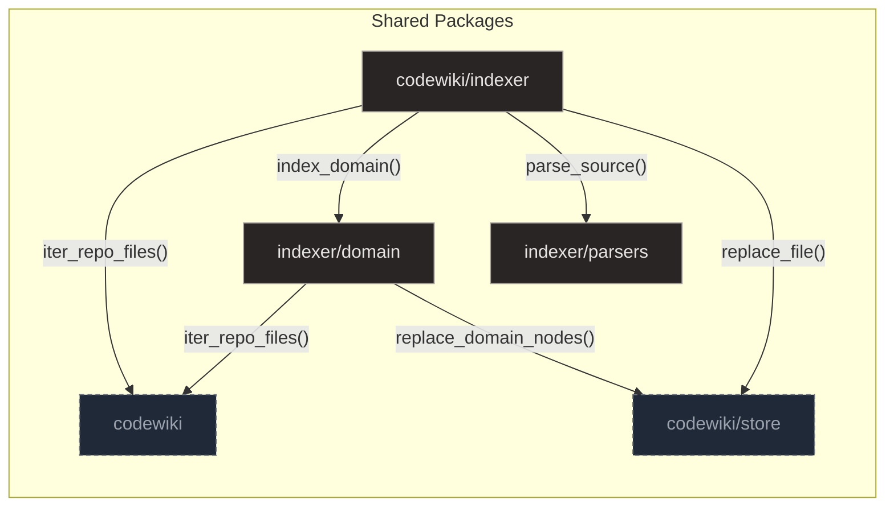

# Indexer

## Purpose and Scope

The `codewiki/indexer` package orchestrates a multi-stage indexing workflow designed for deterministic behavior without Large Language Models. This process begins with file discovery and metadata collection, followed by parsing source files into structured graph representations using tree-sitter and hierarchical hashing for change detection. These raw symbols are persisted to SQLite, after which a resolution phase connects isolated file analyses by resolving cross-file imports and call edges. Finally, a synchronization engine manages incremental updates, ensuring the database accurately reflects the current repository state while providing lightweight statistics on indexing outcomes.

The `codewiki/indexer/parsers` module acts as the central entry point for source code analysis, normalizing input from multiple languages into a single `FileParse` shape. It employs a lazy initialization pattern via `_load` to cache language-specific extractors for Python, Rust, and TypeScript, ensuring efficient resource usage. The `parse_source` function serves as a central dispatcher, retrieving the correct extractor and invoking it to produce a structured representation of symbols and spans. This design ensures consistent output for downstream consumers like dependency graph builders and test suites.

**Sources:**
- [__init__.py:1-38](https://github.com/doxiebuilds/codewiki/blob/main/codewiki/indexer/parsers/__init__.py#L1-L38)

---

## Architecture

The indexer employs a layered architecture that orchestrates a multi-stage workflow to normalize input from multiple languages into a deterministic code graph without LLMs. This design separates concerns into discovery, parsing, domain extraction, and persistence layers to ensure reliable isolation of failures and consistent data representation.

The discovery layer serves as the initial data collection step, iterating through the repository root to construct `FileMeta` records for valid UTF-8 files. It applies inclusion filters to skip vendor trees and uses SHA-256 hashes as change signals to gate re-parsing, ensuring only relevant files are processed.

- **Discovery**: The `discover` function in `discovery.py` handles file enumeration and metadata collection, while `head_sha` retrieves the current Git commit identifier for version context.

Language-specific parsers form the next layer, transforming raw source files into structured graph representations using tree-sitter and hierarchical hashing. The `base.py` module defines foundational data structures like `Symbol`, `Import`, and `FileParse` to represent code elements in a flat, parent-linked structure.

- **Parsing**: The `parse_source` function acts as a central dispatcher, retrieving the correct language-specific extractor to produce a structured representation of symbols and spans.

Domain extractors utilize a registry-based plugin system to enumerate system components like HTTP routes, database schemas, and FFI exports. The `builtin.py` module supplies specific static analysis extractors that parse Python, SQL, Rust, and TypeScript files using regex patterns and database queries.

- **Domain Extraction**: Extractors such as `extract_routes` and `extract_db_tables` correlate frontend API calls with backend definitions, operating deterministically without reliance on external AI models.

The core graph persistence engine transforms raw source files into structured graph data and persists indexed data via database operations. It computes hierarchical rollup hashes where leaf nodes hash their source spans and containers hash their signatures combined with sorted child hashes, enabling precise incremental change detection.

- **Persistence**: The `graph.py` module provides functionality to reconstruct a complete directed graph from stored symbols and edges for downstream analysis, while the store layer handles file replacement and metadata updates.

**Sources:**
- [discovery.py:1-54](https://github.com/doxiebuilds/codewiki/blob/main/codewiki/indexer/discovery.py#L1-L54)
- [builtin.py:1-287](https://github.com/doxiebuilds/codewiki/blob/main/codewiki/indexer/domain/builtin.py#L1-L287)
- [graph.py:1-166](https://github.com/doxiebuilds/codewiki/blob/main/codewiki/indexer/graph.py#L1-L166)
- [base.py:1-84](https://github.com/doxiebuilds/codewiki/blob/main/codewiki/indexer/parsers/base.py#L1-L84)

---

## Discovery and Parsing

Covers the initial data collection step and the language-specific extraction engines (Python, Rust, TypeScript) that transform raw source files into standardized intermediate representations.

- **module typescript.py** — This module serves as the TypeScript parser for the code indexer, converting raw source code into a standardized inte…
- **module rust.py** — This module serves as the Rust-specific parser for the code indexer, leveraging tree-sitter to generate an Abstract Syntax …
- **module python.py** — This module serves as the Python-specific extraction engine for the code indexer, leveraging tree-sitter to build a hiera…
- **module discovery.py** — The discovery module serves as the initial data collection step in the indexing pipeline, providing the foundational m…
- **symbol function parse** — This function serves as the entry point for parsing Python files, leveraging tree-sitter to build a comprehensive re…
- **symbol function discover** — The discover function iterates through all files in the repository root, filtering them using should_include to i…
- **symbol function parse** — This function serves as the entry point for parsing Rust files, leveraging tree-sitter to generate an AST and recurs…

**Sources:**
- [typescript.py:1-204](https://github.com/doxiebuilds/codewiki/blob/main/codewiki/indexer/parsers/typescript.py#L1-L204)
- [rust.py:1-204](https://github.com/doxiebuilds/codewiki/blob/main/codewiki/indexer/parsers/rust.py#L1-L204)
- [python.py:1-186](https://github.com/doxiebuilds/codewiki/blob/main/codewiki/indexer/parsers/python.py#L1-L186)
- [discovery.py:1-54](https://github.com/doxiebuilds/codewiki/blob/main/codewiki/indexer/discovery.py#L1-L54)
- [python.py:20-38](https://github.com/doxiebuilds/codewiki/blob/main/codewiki/indexer/parsers/python.py#L20-L38)
- [discovery.py:29-43](https://github.com/doxiebuilds/codewiki/blob/main/codewiki/indexer/discovery.py#L29-L43)

---

## Domain Extraction

The domain package implements a registry-based plugin system for extracting specific domain nodes, such as HTTP routes or database tables, from codebases. It manages the lifecycle of extractors through registration and unregistration, supporting explicit dependency ordering via an 'after' parameter to ensure correct execution sequences. The core workflow is handled by `index_domain`, which iterates through the ordered registry, executes each extractor against a database connection, and persists the resulting domain nodes while isolating individual failures. This design ensures deterministic and reliable enumeration of system components for downstream assembly.

### Route Extraction

The `extract_routes` function iterates through all Python files in the project root, searching for lines matching a route pattern. For each match, it looks ahead up to 5 lines to find the defining function, constructs a unique key based on the HTTP verb and route, and appends a structured dictionary to the result list if the route hasn't been seen before. This process populates the indexer's route database, enabling the correlation of frontend API calls with backend route definitions.

### Database & Redis Extraction

The `extract_db_tables` function iterates through all `.sql` files in the repository, using a regex to find table definitions and recording their names, file paths, and line numbers while deduplicating by name. For Redis communication patterns, `extract_redis_channels` scans Python files for Redis client method calls like `.publish` or `.subscribe` to identify channel usage. It aggregates these usages by channel name, tracking per-direction site counts and source locations, while filtering out noise like non-namespaced literals. For each identified channel, it creates a node and generates edges linking the defining symbols to the channel, resolving symbol IDs via `_enclosing_symbol_id` and persisting them via `db.replace_edges_of_kinds`.

**Sources:**
- [base.py:1-69](https://github.com/doxiebuilds/codewiki/blob/main/codewiki/indexer/domain/base.py#L1-L69)
- [base.py:55-68](https://github.com/doxiebuilds/codewiki/blob/main/codewiki/indexer/domain/base.py#L55-L68)
- [builtin.py:1-287](https://github.com/doxiebuilds/codewiki/blob/main/codewiki/indexer/domain/builtin.py#L1-L287)
- [builtin.py:69-92](https://github.com/doxiebuilds/codewiki/blob/main/codewiki/indexer/domain/builtin.py#L69-L92)
- [builtin.py:95-108](https://github.com/doxiebuilds/codewiki/blob/main/codewiki/indexer/domain/builtin.py#L95-L108)
- [builtin.py:111-149](https://github.com/doxiebuilds/codewiki/blob/main/codewiki/indexer/domain/builtin.py#L111-L149)

---

## Graph Resolution and Persistence

The `codewiki/indexer/graph` module serves as the core extraction and persistence layer, transforming raw source files into structured graph data without relying on LLMs. It processes files by extracting symbols and relationships, then computes hierarchical rollup hashes where leaf nodes hash their source spans and containers hash their signatures combined with sorted child hashes, enabling precise incremental change detection. The indexed data is persisted via database operations, and the module also provides functionality to reconstruct a complete directed graph from the stored symbols and edges for downstream analysis.

### Edge Resolution

The `codewiki/indexer/resolve` module serves as the finalization step in the indexing pipeline, connecting isolated file analyses into a cohesive global graph. It begins by resolving import edges, utilizing language-specific helpers to map symbolic names to concrete file candidates for Python, TypeScript, and Rust. In a second pass, it resolves dangling call edges by matching target names against symbols found in previously imported files or by identifying unique global symbols. The module also cleans up stale resolutions and categorizes same-file calls, ensuring the resulting graph accurately reflects cross-package architectural flows.

- **Import Resolution**: The first pass matches destination names against candidate files using language-specific candidate generators, updating the edges table with the resolved module symbol ID.
- **Call Resolution**: The second pass resolves dangling call edges by checking if the target name exists in previously imported files (prioritizing specific kinds like functions/methods) or if it is a unique name across all symbols, updating the edges table accordingly.
- **Cleanup**: The process cleans up stale resolutions pointing to non-existent symbols and tags same-file calls as 'local' to maintain graph integrity.

### File Indexing

The `_rows_for_file` function in `codewiki/indexer/graph` serves as the core extraction unit for indexing a single source file, transforming raw file metadata and parsed source code into structured relational rows. It first determines the package context and creates a base file row; if the language is unsupported or parsing fails, it returns a minimal 'module' symbol row to ensure the file remains citable. For parseable files, it iterates through symbols to generate unique IDs, resolves parent-child hierarchies using qualified names, and constructs 'contains' and 'calls' edges based on local symbol targets and import statements. It is called by `index_file` to process individual files within the broader indexing pipeline.

**Sources:**
- [graph.py:1-166](https://github.com/doxiebuilds/codewiki/blob/main/codewiki/indexer/graph.py#L1-L166)
- [graph.py:71-147](https://github.com/doxiebuilds/codewiki/blob/main/codewiki/indexer/graph.py#L71-L147)
- [resolve.py:1-174](https://github.com/doxiebuilds/codewiki/blob/main/codewiki/indexer/resolve.py#L1-L174)
- [resolve.py:114-173](https://github.com/doxiebuilds/codewiki/blob/main/codewiki/indexer/resolve.py#L114-L173)

---

## Where to Start & Watch-Outs

The `run.py` module serves as the core synchronization engine, ensuring the database accurately reflects the current repository state without relying on LLMs. It operates by comparing file hashes to identify changes, delegating parsing to `graph.index_file` for additions or modifications, and handling deletion logic for removed files. This deterministic, low-cost workflow is designed to be safe for execution on every push, supporting both full and incremental indexing strategies.

The `run_index` function orchestrates this process by comparing current file metadata against stored hashes to identify added, modified, and removed files. It delegates file processing to `graph.index_file` for new or changed files and `db.delete_file` for removed ones, then updates metadata like schema version and head SHA. Called by `_cmd_index` and `_cmd_update`, it serves as the core synchronization logic for the indexer, ensuring the database reflects the current repository state.

Potential pitfalls in deterministic behavior and edge resolution often arise when mapping symbolic imports to concrete file locations. The `_python_candidates` function resolves Python import strings into potential file paths by handling both relative imports (preceded by dots) and absolute imports. It calculates the base directory by traversing up from the source file for relative imports, or uses a configured source subdirectory for absolute ones, then generates candidates by progressively shortening the module path to check for both module files and packages.

Similarly, the `_rust_candidates` function parses a Rust `use` statement to determine the module path relative to the current source file. It handles `crate`, `super`, and `self` prefixes to calculate the correct base directory, then generates candidate file paths by appending `.rs` and `/mod.rs` to progressively shorter module prefixes. This ensures reliable isolation of failures during the indexing process by mapping symbolic imports to concrete file locations.

**Sources:**
- [run.py:1-68](https://github.com/doxiebuilds/codewiki/blob/main/codewiki/indexer/run.py#L1-L68)
- [run.py:36-67](https://github.com/doxiebuilds/codewiki/blob/main/codewiki/indexer/run.py#L36-L67)
- [resolve.py:47-69](https://github.com/doxiebuilds/codewiki/blob/main/codewiki/indexer/resolve.py#L47-L69)
- [resolve.py:82-106](https://github.com/doxiebuilds/codewiki/blob/main/codewiki/indexer/resolve.py#L82-L106)