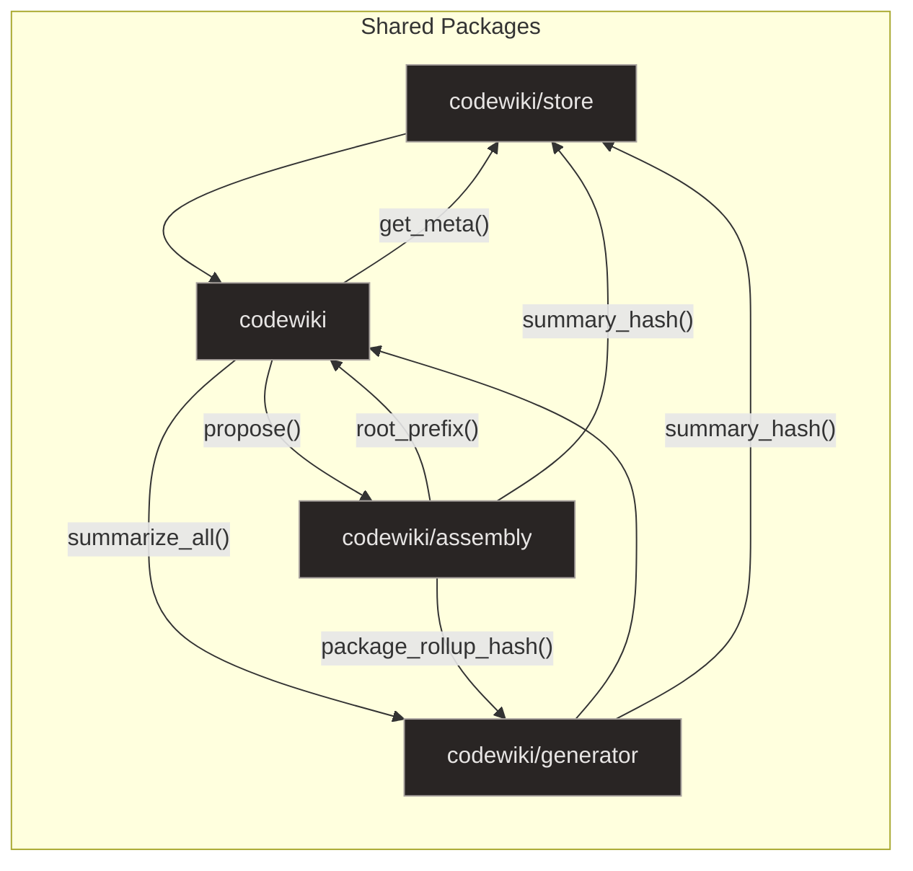

# Overview

## Purpose and Scope

### System Workflow

The CodeWiki system operates through a three-stage workflow that begins with indexing code into a SQLite graph, followed by generating LLM-based summaries, and finally assembling Markdown output. The `codewiki/build` module acts as the central controller, routing CLI commands to specialized handlers while ensuring robustness through file locking and pre-flight checks. This pipeline orchestrates the transition from raw source code to structured documentation, ensuring that each stage feeds deterministically into the next.

The indexing phase is handled by the `codewiki/indexer` package, which orchestrates a multi-stage workflow designed for deterministic behavior without Large Language Models. The process begins with file discovery and metadata collection, followed by parsing source files into structured graph representations using tree-sitter and hierarchical hashing for change detection. These raw symbols are persisted to SQLite, after which a resolution phase connects isolated file analyses by resolving cross-file imports and call edges.

### Core Philosophy

The core philosophy of the system is to replace stochastic context retrieval with deterministic, pre-computed evidence bundles. The `codewiki/writer` package implements a 'plan-then-fill' documentation pipeline that ensures efficiency through SHA-256 hashing for incremental builds. This approach provides deterministic fallbacks to Jinja templates when LLM generation fails, maintaining consistency in the final output.

The planning stage is managed by `skeleton.py`, which converts an evidence catalog into a structured page outline. It primarily relies on an LLM to generate a JSON plan of sections, which is then parsed, validated, and normalized to ensure structural integrity. If LLM generation fails or produces invalid output, the system degrades gracefully by invoking a fallback mechanism that constructs a deterministic outline based on predefined rules and evidence grouping.

**Sources:**
- [build.py:1-332](https://github.com/doxiebuilds/codewiki/blob/main/codewiki/build.py#L1-L332)
- [skeleton.py:1-310](https://github.com/doxiebuilds/codewiki/blob/main/codewiki/writer/skeleton.py#L1-L310)

---

## Architecture

The CodeWiki system is structured around a deterministic pipeline that replaces stochastic context retrieval with structured code graph analysis. This architecture is composed of specialized packages for indexing, generation, assembly, and serving, all coordinated through a central SQLite code-graph. The following diagram illustrates the high-level component interactions and dependencies.

### Package Dependencies

The system relies on a modular design where each package handles a specific stage of the documentation lifecycle. The `codewiki/indexer` package orchestrates the multi-stage indexing workflow, using `codewiki/indexer/parsers` to normalize source code into structured graph representations. The `codewiki/store` package provides the foundational storage backend, managing database operations and artifact lifecycle through `db.py` and `schema.sql`.

The `codewiki/generator` package acts as the central orchestrator for code generation, focusing on hierarchical summarization while isolating AI-dependent logic. It interacts with the assembly phase through `codewiki/assembly`, which combines taxonomy definitions with runtime graph data to create static documentation. The `codewiki/server` package then serves this content via an asynchronous FastAPI interface, ensuring resilient access to wiki data.

### Data Flow

Data flows through the system via a plan-then-fill mechanism, where skeletons are generated and evidence is assembled into bundles. The `bundle.py` module serves as the central data assembly layer, querying the database for package summaries and dependency edges to create a unified `PageBundle`. This bundle is then passed to the writer for section-by-section generation, ensuring deterministic output.

Validation is a critical step in the data flow, handled by `validate.py`. This module operates as a quality gate, orchestrating repair stages for Mermaid diagrams, citations, and structural checks. By automatically fixing common LLM generation errors, the system ensures that the final documentation remains accurate and synchronized with the source code.

**Sources:**
- [bundle.py:1-418](https://github.com/doxiebuilds/codewiki/blob/main/codewiki/writer/bundle.py#L1-L418)
- [validate.py:1-432](https://github.com/doxiebuilds/codewiki/blob/main/codewiki/writer/validate.py#L1-L432)

---

## Indexing Pipeline

Details the multi-stage indexing workflow: discovery, parsing, extraction, and resolution, ensuring deterministic behavior without LLMs for graph construction.

- **pkg codewiki/indexer/domain** — The domain package implements a deterministic indexing workflow that enumerates system components like HTTP ro…
- **module typescript.py** — This module serves as the TypeScript parser for the code indexer, converting raw source code into a standardized inte…
- **module rust.py** — This module serves as the Rust-specific parser for the code indexer, leveraging tree-sitter to generate an Abstract Syntax …
- **module python.py** — This module serves as the Python-specific extraction engine for the code indexer, leveraging tree-sitter to build a hiera…
- **module base.py** — This module serves as the foundational layer for the code indexer, defining the primary data structures and low-level utili…
- **module graph.py** — The module serves as the core extraction and persistence layer for the code indexer, transforming raw source files into st…
- **module resolve.py** — This module serves as the finalization step in the indexing pipeline, connecting isolated file analyses into a cohesive …
- **module discovery.py** — The discovery module serves as the initial data collection step in the indexing pipeline, providing the foundational m…
- **module run.py** — The run.py module serves as the core synchronization engine for the code indexer, ensuring the database accurately reflects …
- **symbol function _rows_for_file** — This function serves as the core extraction unit for indexing a single source file, transforming raw file m…
- **symbol function resolve_all** — The function performs a two-pass resolution of dangling edges in the code graph. First, it resolves import edg…
- **symbol function _structural_edges** — This function builds a structural dependency graph by querying the database for import edges (which form…

**Sources:**
- [typescript.py:1-204](https://github.com/doxiebuilds/codewiki/blob/main/codewiki/indexer/parsers/typescript.py#L1-L204)
- [rust.py:1-204](https://github.com/doxiebuilds/codewiki/blob/main/codewiki/indexer/parsers/rust.py#L1-L204)
- [python.py:1-186](https://github.com/doxiebuilds/codewiki/blob/main/codewiki/indexer/parsers/python.py#L1-L186)
- [base.py:1-84](https://github.com/doxiebuilds/codewiki/blob/main/codewiki/indexer/parsers/base.py#L1-L84)
- [graph.py:1-166](https://github.com/doxiebuilds/codewiki/blob/main/codewiki/indexer/graph.py#L1-L166)
- [resolve.py:1-174](https://github.com/doxiebuilds/codewiki/blob/main/codewiki/indexer/resolve.py#L1-L174)

---

## Documentation Generation

The documentation generation system implements a deterministic plan-then-fill pipeline that replaces stochastic context retrieval with structured, pre-computed evidence bundles. This approach ensures that generated pages remain synchronized with the source code while maintaining strict validation and reproducibility. The workflow is orchestrated by `assemble_writer`, which iterates through page specifications and invokes the core `write_page` function for each target.

### Skeleton Planning

The first stage of the pipeline involves converting an evidence catalog into a structured page outline using the `skeleton.py` module. This process primarily relies on an LLM to generate a JSON plan of sections, which is then parsed and validated to ensure structural integrity. If the LLM generation fails or produces invalid output, the system degrades gracefully by invoking `fallback_skeleton`, which constructs a deterministic outline based on predefined rules and evidence grouping.

The `validate_skeleton` function acts as a critical gatekeeper, transforming unvalidated input into a canonical `Skeleton` structure while enforcing strict invariants. It performs deterministic fixups such as deduplicating headings, merging sections with insufficient evidence, and ensuring a canonical 'Watch-outs' section exists at the end. Additionally, it caps the total number of sections and pins exactly one architecture diagram to the second section to maintain consistency.

### Evidence Assembly

Before writing content, the system assembles a comprehensive context bundle using the `bundle.py` module, which replaces stochastic LLM context retrieval with deterministic, pre-computed code facts. The `build_bundle` function serves as the central assembly point, iterating through specified packages to fetch package summaries, module rows, and key symbol rows while applying limits to control output size. It further enriches the bundle by extracting source code excerpts, computing edge digests, and generating Mermaid dependency diagrams.

To ensure the output fits within LLM token limits, the module employs a budget-trimming mechanism via `trim_to_budget`. This function iteratively removes lower-priority evidence items or truncates tables if the bundle exceeds the specified token count. The `_build_evidence` function aggregates diverse metadata from the `PageBundle` into a standardized list of `EvidenceItem` objects, each tagged with a specific kind such as package, module, symbol, or edge.

### Page Writing

The `write_page` function implements the multi-stage pipeline for generating documentation, acting as the core writer invoked by the assembly coordinator. It begins by checking for cached builds to skip regeneration, then proceeds through four distinct stages: planning the page skeleton, consecutively filling sections, generating diagrams, and finally assembling the Markdown. This consecutive filling strategy keeps the prompt-prefix cache hot, improving efficiency and consistency across sections.

After assembly, the system runs whole-page validation checks via `assemble_page` to ensure unbalanced code fences, minimum section counts, and minimum source citations are met. The `validate.py` module serves as a quality gate, orchestrating three sequential repair stages: Mermaid diagram sanitization, citation repair, and structural checking. This design allows the system to automatically fix common LLM generation errors, such as invalid references or malformed diagrams, before finalizing the content.

**Sources:**
- [bundle.py:1-418](https://github.com/doxiebuilds/codewiki/blob/main/codewiki/writer/bundle.py#L1-L418)
- [bundle.py:265-317](https://github.com/doxiebuilds/codewiki/blob/main/codewiki/writer/bundle.py#L265-L317)
- [bundle.py:376-417](https://github.com/doxiebuilds/codewiki/blob/main/codewiki/writer/bundle.py#L376-L417)
- [skeleton.py:1-310](https://github.com/doxiebuilds/codewiki/blob/main/codewiki/writer/skeleton.py#L1-L310)
- [skeleton.py:113-224](https://github.com/doxiebuilds/codewiki/blob/main/codewiki/writer/skeleton.py#L113-L224)
- [skeleton.py:228-275](https://github.com/doxiebuilds/codewiki/blob/main/codewiki/writer/skeleton.py#L228-L275)

---

## Visualization and Server

### Diagram Generation

The `codewiki/assembly/diagrams` module serves as the core engine for visualizing the system's architecture by converting code graph data into faithful Mermaid flowcharts. It operates by resolving imports, classifying packages into defined layers, and extracting both structural (import/call) and channel (publish/consume) edges from the database. The module then constructs the diagram by grouping nodes into layered subgraphs, applying specific CSS classes, and filtering out noise like test packages or generic method names. This ensures the output is a clean, deterministic representation of the real code dependencies without invented edges.

The `package_dependency_mermaid` function constructs a layered architecture diagram by querying the database for structural edges and Redis channel connections, then filtering and ranking nodes to ensure readability and coverage of all architectural layers. It explicitly excludes test packages when `include_tests=False` to prevent test scaffolding from dominating the view of non-test pages. The function is called by `build_page` and `build_bundle` to generate visual representations of system structure, and is tested in `test_diagrams.py` to verify correct node creation and edge filtering.

The `_emit` function constructs a Mermaid flowchart by first grouping nodes into subgraphs based on their assigned layers, using `_layer_order` to determine the rendering sequence and `_layer_title` for subgraph headers. It then appends edge definitions between nodes, followed by class definitions and class assignments derived from the `node_class` mapping. This function serves as the core rendering engine for diagram generation, called by `package_dependency_mermaid` to produce the final visual output and verified by `test_emit_is_flowchart_with_subgraphs_and_classes`.

### Web Interface

The `codewiki/server/app` module acts as the reference HTTP interface for the codewiki system, bridging the synchronous reader logic with an asynchronous FastAPI server. It offloads blocking I/O operations like manifest loading, page retrieval, and searching to thread pools to prevent event loop stagnation, while implementing defensive error handling to keep the frontend accessible even when data sources fail. For maintenance, it manages background wiki rebuilds by spawning detached subprocesses, tracking their lifecycle via PID checks and atomic status file updates, and providing endpoints to monitor or terminate these long-running tasks.

The `refresh` endpoint serves as the trigger for a full wiki rebuild, ensuring the operation is idempotent by checking for an existing running process via `_pid_is_running` and `load_refresh_status`. It first validates that the local LLM server is reachable (`lmstudio_up`), returning a 503 error if not. Upon validation, it spawns a detached subprocess using `subprocess.Popen` with `start_new_session=True` to run the build command, capturing output to a log file. Finally, it writes an initial 'running' status to the status file via `_write_status` to allow immediate polling by callers, while the child process updates this file with detailed progress.

The `reader` module serves as the core data access layer for a generated wiki, offering plain functions that can be wrapped by any web framework or CLI tool. It maintains an in-memory cache of the wiki manifest, invalidating it when the underlying file changes, to ensure efficient and consistent access to page metadata. Primary operations include retrieving individual pages with strict path traversal protection and performing case-insensitive searches across titles and content. Additionally, it handles the loading of system refresh status from a dedicated JSON file, abstracting away file I/O errors and serialization issues for callers.

**Sources:**
- [diagrams.py:1-355](https://github.com/doxiebuilds/codewiki/blob/main/codewiki/assembly/diagrams.py#L1-L355)
- [diagrams.py:258-354](https://github.com/doxiebuilds/codewiki/blob/main/codewiki/assembly/diagrams.py#L258-L354)
- [diagrams.py:216-255](https://github.com/doxiebuilds/codewiki/blob/main/codewiki/assembly/diagrams.py#L216-L255)
- [app.py:1-188](https://github.com/doxiebuilds/codewiki/blob/main/codewiki/server/app.py#L1-L188)
- [app.py:95-130](https://github.com/doxiebuilds/codewiki/blob/main/codewiki/server/app.py#L95-L130)
- [reader.py:1-103](https://github.com/doxiebuilds/codewiki/blob/main/codewiki/server/reader.py#L1-L103)

---

## Where to Start & Watch-Outs

### CLI Entry Points

The `codewiki` CLI is exposed through the `main` function in `build.py`, which registers subcommands like `init`, `index`, `summarize`, `calibrate`, `assemble`, and `update`. The `init` command invokes `propose` from `scaffold.py` to generate a YAML navigation structure based on package statistics and domain metadata. For ongoing maintenance, the `update` command in `build.py` orchestrates the full pipeline, acquiring an exclusive lock and delegating to specialized handlers for indexing and assembly.

- **Initialization**: The `codewiki init` command uses `scaffold.py` to query the database and render a `codewiki.yaml` configuration file that defines the site's initial structure.
- **Updates**: The `codewiki update` command handles incremental changes by locking the database, indexing modified symbols, and assembling the final Markdown output.
- **Progress Tracking**: The `StatusReporter` class in `progress.py` provides a debounced, atomic write mechanism to track build stages and completion percentages for external consumers.

### Calibration

Before generating documentation, the system requires LLM calibration to ensure summaries are concise and accurate. The `run_calibration` function in `calibrate.py` selects a balanced set of representative code nodes and generates summaries using a specified model. These outputs are written to Markdown files for human verification, allowing developers to adjust prompts or model settings before committing to a full build.

- **Sampling**: The calibration process uses stratified sampling to select a small, pinned set of code nodes that represent the repository's complexity.
- **Verification**: Generated summaries, prompts, and source code are saved to disk, enabling developers to review the LLM's behavior against known good examples.
- **Configuration**: Settings for the calibration run are resolved from `config.py`, which checks environment variables and local configuration files in a specific order.

### Validation Constraints

The documentation pipeline enforces strict validation to prevent hallucinated citations and structural errors. The `repair_citations` function in `validate.py` sanitizes architectural references by clamping line ranges and dropping links to unknown files. Similarly, `repair_entries` in `sources.py` ensures that all evidence locations are within valid file bounds and belong to the allowed set of sources.

- **Citation Integrity**: The `repair_citations` function prefixes rootless paths and removes citations that point to files outside the project or exceed file lengths.
- **Source Validation**: The `repair_entries` function filters evidence locations to ensure they fall within the allowed set and clamps line numbers to actual file sizes.
- **Section Checks**: The `check_section` function enforces structural rules, such as balanced code fences and the absence of conversational preambles, before finalizing a page.

**Sources:**
- [scaffold.py:1-179](https://github.com/doxiebuilds/codewiki/blob/main/codewiki/assembly/scaffold.py#L1-L179)
- [scaffold.py:112-150](https://github.com/doxiebuilds/codewiki/blob/main/codewiki/assembly/scaffold.py#L112-L150)
- [build.py:194-237](https://github.com/doxiebuilds/codewiki/blob/main/codewiki/build.py#L194-L237)
- [build.py:272-327](https://github.com/doxiebuilds/codewiki/blob/main/codewiki/build.py#L272-L327)
- [config.py:1-148](https://github.com/doxiebuilds/codewiki/blob/main/codewiki/config.py#L1-L148)
- [calibrate.py:118-153](https://github.com/doxiebuilds/codewiki/blob/main/codewiki/generator/calibrate.py#L118-L153)