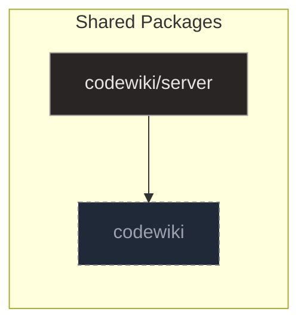

# Server

## Purpose and Scope

The `codewiki/server` package orchestrates the web interface for the codewiki system, serving as the bridge between synchronous reader logic and an asynchronous FastAPI server. It relies on `app.py` as the reference HTTP layer and `reader.py` as the core data access module to ensure efficient and resilient access to wiki data.

### HTTP Interface and Asynchronous Handling

`app.py` acts as the reference HTTP interface, bridging synchronous reader logic with the asynchronous FastAPI server to handle web requests. It offloads blocking I/O operations, such as manifest loading, page retrieval, and searching, to thread pools to prevent event loop stagnation. This architecture ensures that the frontend remains accessible even when data sources fail, supported by defensive error handling mechanisms.

### Background Maintenance and Lifecycle Management

For system maintenance, the package manages background wiki rebuilds by spawning detached subprocesses to handle long-running tasks. It tracks the lifecycle of these processes via PID checks and atomic status file updates, providing endpoints to monitor or terminate them as needed. This approach allows the server to perform necessary updates without blocking the main event loop or degrading user experience.

**Sources:**
- [app.py:1-188](https://github.com/doxiebuilds/codewiki/blob/main/codewiki/server/app.py#L1-L188)

---

## Architecture

The `codewiki/server` package orchestrates the web interface by separating the HTTP layer in `app.py` from the core data access logic in `reader.py`. `app.py` bridges synchronous reader logic with an asynchronous FastAPI server, offloading blocking I/O to thread pools and managing background wiki rebuilds through detached subprocesses. `reader.py` abstracts file I/O and serialization, maintaining an in-memory manifest cache and enforcing security constraints like path traversal protection.

`app.py` acts as the reference HTTP interface, implementing defensive error handling to keep the frontend accessible even when data sources fail. It manages background wiki rebuilds by spawning detached subprocesses, tracking their lifecycle via PID checks and atomic status file updates, and providing endpoints to monitor or terminate these long-running tasks.

`reader.py` serves as the core data access layer, offering plain functions that can be wrapped by any web framework or CLI tool. It maintains an in-memory cache of the wiki manifest, invalidating it when the underlying file changes, to ensure efficient and consistent access to page metadata. Primary operations include retrieving individual pages with strict path traversal protection and performing case-insensitive searches across titles and content. Additionally, it handles the loading of system refresh status from a dedicated JSON file, abstracting away file I/O errors and serialization issues for callers.

**Sources:**
- [app.py:1-188](https://github.com/doxiebuilds/codewiki/blob/main/codewiki/server/app.py#L1-L188)
- [reader.py:1-103](https://github.com/doxiebuilds/codewiki/blob/main/codewiki/server/reader.py#L1-L103)

---

## Data Access and Manifest Management

### load_manifest

The `load_manifest` function in `reader.py` retrieves the wiki manifest while implementing a cache invalidation strategy based on the file's modification time. It ensures robustness by catching JSON parsing or OS errors and returning a standardized `{"available": False}` structure, allowing callers to handle missing or corrupt data gracefully. This approach prevents exceptions from propagating to the web layer when the wiki has not yet been generated.

- **Cache Invalidation**: The function checks the manifest's `mtime` against a stored value, returning the cached data if it matches to avoid redundant I/O.
- **Error Handling**: If the file is missing or corrupt, the function returns a safe fallback dictionary rather than raising an exception.

**Sources:**
- `reader.py`

### read_page

The `read_page` function serves as the primary data access point for retrieving wiki page content by combining file content with metadata from the manifest. It first consults the manifest to locate the file path associated with the given slug, then performs security validation to prevent path traversal attacks. The function ensures the resolved file path remains within the designated `WIKI_DIR` before reading the markdown file and constructing the result dictionary.

- **Security Validation**: The function verifies that the resolved path stays inside `WIKI_DIR` to defend against path traversal attacks.
- **Data Construction**: It returns a dictionary containing the slug, title, summary, source references, markdown content, and timestamps.

**Sources:**
- `reader.py`

### get_page

The `get_page` function in `app.py` serves as the API endpoint for fetching wiki pages, delegating the blocking I/O operation to a background thread using `asyncio.to_thread`. This design prevents event loop blocking while providing a non-blocking, RESTful interface for clients to access wiki content. The function handles errors by returning appropriate HTTP status codes, such as 404 for missing pages or 500 for internal failures, via `JSONResponse`.

- **Async Delegation**: Blocking file operations are offloaded to a thread pool to maintain server responsiveness.
- **Error Handling**: The endpoint returns specific HTTP status codes to indicate missing resources or internal server errors.

**Sources:**
- [app.py:75-83](https://github.com/doxiebuilds/codewiki/blob/main/codewiki/server/app.py#L75-L83)
- [reader.py:1-103](https://github.com/doxiebuilds/codewiki/blob/main/codewiki/server/reader.py#L1-L103)
- [reader.py:21-39](https://github.com/doxiebuilds/codewiki/blob/main/codewiki/server/reader.py#L21-L39)
- [reader.py:42-61](https://github.com/doxiebuilds/codewiki/blob/main/codewiki/server/reader.py#L42-L61)
- [reader.py:64-85](https://github.com/doxiebuilds/codewiki/blob/main/codewiki/server/reader.py#L64-L85)

---

## Search Functionality

### search

The `search` function in `reader.py` iterates through the wiki manifest to find matches in page titles and content. It performs case-insensitive checks against the query string and constructs result dictionaries containing the page slug, title, and a text snippet surrounding the match. The search stops early if the number of hits reaches the specified limit, ensuring efficient retrieval of the most relevant results for callers.

The `search` endpoint in `app.py` serves as the API handler for wiki searches, registered at `/api/wiki/search`. It offloads the potentially blocking `reader.search` operation to a background thread using `asyncio.to_thread` to prevent blocking the event loop. On success, it returns the query and results; on failure, it catches exceptions and returns a 200 status with an error message in the response body.

**Sources:**
- [reader.py:64-85](https://github.com/doxiebuilds/codewiki/blob/main/codewiki/server/reader.py#L64-L85)
- [app.py:86-92](https://github.com/doxiebuilds/codewiki/blob/main/codewiki/server/app.py#L86-L92)

---

## Background Refresh Orchestration

This section details the lifecycle management of the background wiki rebuild process, covering the triggering, status monitoring, and termination of the asynchronous rebuild task. The system relies on a combination of detached subprocesses, file-based state persistence, and signal-based process control to ensure resilient operation.

### refresh

The `refresh` endpoint initiates a full wiki rebuild by first validating that the local LLM server is reachable, returning a 503 error if it is not. It ensures idempotency by checking for an existing running process via `_pid_is_running` and `load_refresh_status` before proceeding. Upon validation, it spawns a detached subprocess using `subprocess.Popen` with `start_new_session=True` to run the build command, capturing output to a log file. Finally, it writes an initial 'running' status to the status file via `_write_status` to allow immediate polling by callers, while the child process updates this file with detailed progress.

### refresh_status

The `refresh_status` endpoint serves as a health check for the background wiki refresh operation by asynchronously loading the stored refresh status. It checks if the recorded process ID is still active using `_pid_is_running`. If the status indicates 'running' but the process is dead, it marks the state as 'stale' to prevent callers from assuming a hung process is functional. This allows clients to accurately determine whether a refresh is actively proceeding or has failed/stalled.

### refresh_stop

The `refresh_stop` endpoint terminates the background wiki refresh process by first attempting to send SIGTERM to its process group, falling back to the individual process ID if necessary. If the process persists after a short delay, it escalates to SIGKILL to force termination. It then cleans up the process state and updates the status file to reflect that the run was stopped by the user, ensuring callers receive a definitive 'stopped' status.

### load_refresh_status

The `load_refresh_status` function retrieves the current refresh status by reading and parsing a JSON file located at the path returned by `refresh_status_path`. It implements robust error handling by catching `JSONDecodeError` and `OSError`, returning a default `{"state": "idle"}` dictionary if the file is missing, unreadable, or contains invalid JSON. Additionally, it validates that the parsed content is a dictionary, falling back to the idle state if the structure is unexpected. This allows callers to safely query the system's refresh state without needing to manage file I/O or serialization errors themselves.

### _pid_is_running

The `_pid_is_running` function determines process liveness by sending signal 0 to the specified PID. It returns True if the signal is successfully delivered (indicating the process exists and the caller has permission), and False if a `ProcessLookupError`, `PermissionError`, or `OSError` occurs. It is used by `refresh`, `refresh_status`, and `refresh_stop` to verify the state of background tasks before performing operations.

### _write_status

The `_write_status` function ensures reliable status persistence by serializing the input dictionary into a formatted JSON string and writing it to a temporary file before atomically replacing the target status file. This approach prevents partial writes or corruption if the process is interrupted during the write operation. It is called by `refresh` and `refresh_stop` to update the server's operational state, serving as the underlying mechanism for status updates in the application.

### refresh_status_path

The `refresh_status_path` function constructs and returns the absolute path to the 'refresh_status.json' file by joining the application's state directory (imported from `codewiki.paths`) with the filename. It exists to centralize the location of the refresh status file, ensuring consistent path resolution across the module. It is called by `load_refresh_status` to determine where to read or write the current refresh state.

**Sources:**
- [app.py:95-130](https://github.com/doxiebuilds/codewiki/blob/main/codewiki/server/app.py#L95-L130)
- [app.py:133-144](https://github.com/doxiebuilds/codewiki/blob/main/codewiki/server/app.py#L133-L144)
- [app.py:147-187](https://github.com/doxiebuilds/codewiki/blob/main/codewiki/server/app.py#L147-L187)
- [reader.py:93-102](https://github.com/doxiebuilds/codewiki/blob/main/codewiki/server/reader.py#L93-L102)
- [app.py:51-56](https://github.com/doxiebuilds/codewiki/blob/main/codewiki/server/app.py#L51-L56)
- [app.py:59-63](https://github.com/doxiebuilds/codewiki/blob/main/codewiki/server/app.py#L59-L63)

---

## Where to Start & Watch-Outs

### Entry Points for New Developers

New developers should begin by examining `app.py` as the reference HTTP interface, which bridges synchronous reader logic with the asynchronous FastAPI server. This module demonstrates how to offload blocking I/O operations, such as manifest loading and page retrieval, to thread pools to prevent event loop stagnation.

The `reader.py` module serves as the core data access layer, offering plain functions that can be wrapped by any web framework or CLI tool. It maintains an in-memory cache of the wiki manifest, invalidating it when the underlying file changes to ensure efficient and consistent access to page metadata.

### Watch-Outs and Defensive Patterns

When interacting with the data access layer, developers must be aware of the strict path traversal protection enforced during individual page retrieval. The system also handles the loading of system refresh status from a dedicated JSON file, abstracting away file I/O errors and serialization issues for callers.

For maintenance tasks, the application manages background wiki rebuilds by spawning detached subprocesses and tracking their lifecycle via PID checks and atomic status file updates. Developers should implement defensive error handling to keep the frontend accessible even when data sources fail, ensuring resilience during data source outages.

**Sources:**
- [app.py:1-188](https://github.com/doxiebuilds/codewiki/blob/main/codewiki/server/app.py#L1-L188)
- [reader.py:1-103](https://github.com/doxiebuilds/codewiki/blob/main/codewiki/server/reader.py#L1-L103)