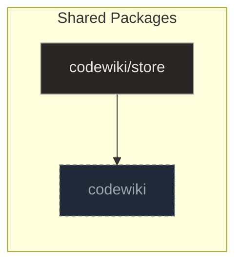

# Store

## Purpose and Scope

The `codewiki/store` package serves as the foundational storage backend for the Code-graph system, ensuring reproducible data persistence without relying on stochastic AI models. It separates concerns across three files: `__init__.py` acts as the entry point, `db.py` handles low-level database operations and artifact lifecycle management, and `schema.sql` defines the deterministic structure based on cryptographic hashes.

By hashing symbols by source span and containers by child rollups, the system enables efficient change detection and ensures that LLM-generated content is only regenerated when underlying code or prompts change. This deterministic approach distinguishes between leaf symbols, hashed by their exact source span, and containers, hashed by a rollup of their children.

The `db.py` module provides a direct, non-ORM interface to an SQLite database, initializing the connection and applying the base schema to ensure compatibility with existing data structures. It supports the indexer, summarizer, and assembler by centralizing database interactions to maintain referential integrity and efficient state management.

**Sources:**
- [db.py:1-184](https://github.com/doxiebuilds/codewiki/blob/main/codewiki/store/db.py#L1-L184)
- [schema.sql:1-100](https://github.com/doxiebuilds/codewiki/blob/main/codewiki/store/schema.sql#L1-L100)

---

## Architecture

The `codewiki/store` package provides the foundational persistence layer for the code-graph system, ensuring reproducible data storage without relying on stochastic AI models. It separates concerns across three primary files: `__init__.py` acts as the entry point, `db.py` handles low-level database operations, and `schema.sql` defines the deterministic structure.

The `db.py` module offers a direct, non-ORM interface to an SQLite database, initializing connections and applying migrations to maintain compatibility with existing data structures. It centralizes database interactions to support the indexer, summarizer, and assembler in maintaining referential integrity and efficient state management.

The `schema.sql` file implements a deterministic database where the primary unit of incremental change is a cryptographic hash. It distinguishes between leaf symbols, hashed by their exact source span, and containers, hashed by a rollup of their children, enabling efficient change detection.

- **Artifact Lifecycle**: The system uses atomic upserts for file metadata and summaries, alongside wholesale replacements for domain nodes and edges to maintain consistency during indexing.
- **LLM Integration**: LLM usage is reserved exclusively for generating hierarchical summaries and wiki pages, with outputs cached and invalidated based on hash mismatches.
- **Change Detection**: By hashing symbols and containers deterministically, the system ensures that LLM-generated content is only regenerated when underlying code or prompts change.

**Sources:**
- [db.py:1-184](https://github.com/doxiebuilds/codewiki/blob/main/codewiki/store/db.py#L1-L184)
- [schema.sql:1-100](https://github.com/doxiebuilds/codewiki/blob/main/codewiki/store/schema.sql#L1-L100)

---

## Key Components

The `codewiki/store` package relies on `db.py` for its persistence layer and `schema.sql` for its deterministic structure. `db.py` provides a non-ORM interface to SQLite, handling everything from connection initialization to atomic upserts and wholesale replacements. `schema.sql` defines the tables that distinguish between leaf symbols hashed by source span and containers hashed by child rollups, enabling efficient change detection.

### Initialization and Schema Management

The `connect` function initializes the storage layer by opening an SQLite database, configuring it to return dictionary rows, and applying the base schema. It immediately calls `_migrate` to ensure compatibility by adding missing columns like `resolved` and `skeleton_json` via `ALTER TABLE` commands.

- **connect**: Opens the database at the specified path and applies the initial schema using `executescript` before running migrations.
- **_migrate**: Checks `PRAGMA table_info` to detect missing columns and executes `ALTER TABLE` commands to add them with default values.

### File and Symbol Persistence

The module provides specialized helpers for managing the lifecycle of code artifacts, including atomic upserts for file metadata and summaries. `replace_file` implements an upsert-like mechanism by deleting existing file rows and their associated symbols, then re-inserting the updated data.

- **replace_file**: Deletes the existing file row (cascading to symbols) and clears remaining edges before re-inserting the file, symbols, and edges.
- **delete_file**: Removes a specific file record from the `files` table and cleans up related graph edges from the `edges` table.
- **all_file_hashes**: Retrieves a dictionary mapping file paths to their SHA-256 hashes for use in the indexing process.

### Edge and Domain Node Management

To maintain consistency during indexing, the system supports wholesale replacements for domain nodes and edges. `replace_domain_nodes` performs an atomic replacement by deleting all entries for a specified kind and bulk inserting new data. `replace_edges_of_kinds` similarly deletes and re-inserts derived edges owned by extractors.

- **replace_domain_nodes**: Deletes all entries for a specified kind and uses `INSERT OR REPLACE` to ensure the database state matches the provided rows.
- **replace_edges_of_kinds**: Deletes all edges with specified kinds and inserts new rows to update relationships like publishes/consumes.

### Summary and Page Build Operations

The system stores symbol hierarchies and LLM-generated summaries, which are cached and invalidated based on hash mismatches. `upsert_summary` persists summary data for a code node, serializing the summary dictionary into a JSON string. `upsert_page_build` handles the persistence of build metadata and status for wiki pages.

- **upsert_summary**: Executes an `INSERT... ON CONFLICT DO UPDATE` statement to persist summary data along with metadata like model name and token counts.
- **upsert_page_build**: Performs an upsert on the `page_builds` table, serializing optional dictionary arguments into JSON strings before binding them.
- **get_summary**: Queries the `summaries` table to fetch the full record associated with a given node_id.
- **summary_hash**: Provides a lightweight lookup for the hash associated with a node_id to support change detection.
- **get_page_build**: Fetches the row corresponding to a provided slug from the `page_builds` table.

### Metadata and Cleanup

The module includes utilities for managing system metadata and cleaning up orphaned data to maintain referential integrity. `set_meta` and `get_meta` provide a reliable mechanism for persisting and retrieving configuration or state information. `prune_orphan_summaries` removes summaries where the associated node no longer exists in the symbols table.

- **set_meta**: Executes an upsert operation on the `meta` table to associate a specified key with a given value.
- **get_meta**: Queries the `meta` table to fetch a value associated with a specific key, returning a default if not found.
- **prune_orphan_summaries**: Removes orphaned symbol-level summaries where the `node_id` does not exist in the `symbols` table.

**Sources:**
- [db.py:1-184](https://github.com/doxiebuilds/codewiki/blob/main/codewiki/store/db.py#L1-L184)
- [db.py:21-30](https://github.com/doxiebuilds/codewiki/blob/main/codewiki/store/db.py#L21-L30)
- [db.py:33-42](https://github.com/doxiebuilds/codewiki/blob/main/codewiki/store/db.py#L33-L42)
- [db.py:60-91](https://github.com/doxiebuilds/codewiki/blob/main/codewiki/store/db.py#L60-L91)
- [db.py:138-149](https://github.com/doxiebuilds/codewiki/blob/main/codewiki/store/db.py#L138-L149)
- [db.py:158-175](https://github.com/doxiebuilds/codewiki/blob/main/codewiki/store/db.py#L158-L175)

---

## Runtime Workflows

### Database Initialization and Migration
The system establishes a persistent connection through `connect`, which creates the database file if necessary and applies the schema defined in `schema.sql`. During this handshake, `_migrate` performs additive column migrations to ensure compatibility with existing databases, such as adding `resolved` to the `edges` table or `skeleton_json` to `page_builds`. This ensures that the runtime environment is always aligned with the current structural requirements before any data operations begin.

### File and Symbol Indexing
When indexing code, `graph.py:index_file` invokes `replace_file` to handle the upsert-like persistence of file metadata and its associated symbols. This function first deletes the existing file row, which cascades to remove its symbols, and then explicitly clears any remaining edges associated with those symbols. It subsequently re-inserts the updated file record, the list of symbols, and the provided edges into the database, ensuring that the graph reflects the current state of the source files.

### Page Build and Summary Persistence
For generated content, `write_page` and `write_quickstart` call `upsert_page_build` to persist build metadata and status using a single SQL statement with `ON CONFLICT` handling. This function serializes optional dictionary arguments like `validator`, `meta`, and `skeleton` into JSON strings before binding them as parameters, ensuring that existing records are updated rather than duplicated when the slug already exists. Similarly, `upsert_summary` manages the persistence of node summaries by inserting or updating records based on the `node_id`, serializing the summary data into JSON for storage.

### Edge Management
Derived edges, such as those representing publishes or consumes relationships, are managed through `replace_edges_of_kinds`, which allows extractors to wholesale-replace specific edge types. This function deletes all existing edges of the specified kinds and then inserts the new rows, ensuring that the graph's connectivity information remains consistent with the latest extraction results. This approach prevents edge accumulation and maintains a clean, deterministic state for the code graph.

**Sources:**
- [db.py:21-30](https://github.com/doxiebuilds/codewiki/blob/main/codewiki/store/db.py#L21-L30)
- [db.py:33-42](https://github.com/doxiebuilds/codewiki/blob/main/codewiki/store/db.py#L33-L42)
- [db.py:60-91](https://github.com/doxiebuilds/codewiki/blob/main/codewiki/store/db.py#L60-L91)
- [db.py:114-124](https://github.com/doxiebuilds/codewiki/blob/main/codewiki/store/db.py#L114-L124)
- [db.py:138-149](https://github.com/doxiebuilds/codewiki/blob/main/codewiki/store/db.py#L138-L149)
- [db.py:158-175](https://github.com/doxiebuilds/codewiki/blob/main/codewiki/store/db.py#L158-L175)

---

## Where to Start & Watch-Outs

Entry points into the store package are primarily the public symbols exposed in `__init__.py`, which serve as the main interface for external consumers. Developers should begin by importing these high-level functions rather than reaching directly into `db.py` or `schema.sql`, as the internal modules handle low-level database transactions and schema enforcement. This separation ensures that changes to the underlying storage mechanism do not break external integrations.

When modifying the store, adhere to the invariant that all data persistence must be deterministic and reproducible. Avoid introducing non-deterministic operations or external dependencies that could alter the cryptographic hashes of symbols or containers. Any changes to `schema.sql` must be accompanied by corresponding migration logic to maintain backward compatibility.

- __init__.py
- db.py
- schema.sql