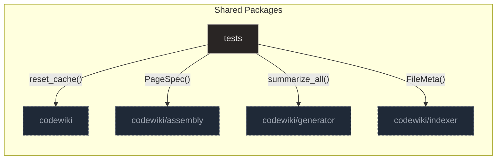

# Testing

## Purpose and Scope

The `tests` package serves as the quality assurance backbone for the codewiki system, ensuring that all major components function correctly in both isolation and integration. It leverages a centralized configuration module to create reproducible, stateless environments, allowing tests to verify complex workflows such as incremental updates, citation resolution, and diagram generation without side effects.

The suite is organized by functional area, with dedicated modules for testing the writer's validation and assembly pipelines, the core resolution engine, and the scaffolding subsystem. By mocking external dependencies like LLMs and file systems, the tests guarantee that the system remains robust, deterministic, and consistent across various edge cases and failure modes.

**Sources:**
- [conftest.py:1-100](https://github.com/doxiebuilds/codewiki/blob/main/tests/conftest.py#L1-L100)

---

## Architecture

The test suite is organized around a central configuration module that ensures all tests operate against a consistent, isolated state. This setup mocks environment variables to fix repository paths and clears global caches to prevent state leakage between test runs.

### Test Infrastructure

The core setup logic resides in the `_seed` function, which creates a temporary database and indexes predefined source code to simulate API structures. This function triggers the summarization pipeline with mocked responses, providing a fully initialized connection for tests via fixtures like `seeded_conn` and `seeded_conn_with_tests`.

For unit tests requiring a minimal project structure, the `mini_repo` fixture constructs a temporary directory populated with representative files such as FastAPI routes and SQL schemas. It uses `monkeypatch` to override `PROJECT_ROOT` and `REPO_ROOT` constants, ensuring tests operate against the temporary structure without side effects on the real codebase.

### Test Doubles

The suite relies on deterministic mocks for external dependencies, particularly the LLM interface used by the writer. The `make_llm` function constructs a stub that routes requests to specific handlers based on the system prompt type, incrementing counters to allow tests to verify interaction patterns.

This stub returns pre-defined responses based on the 'system' prompt type, enabling tests to simulate LLM behavior deterministically. It is essential for validating retry logic and fallback mechanisms, such as in tests that check how the system handles bad sections or missing planner JSON.

### Module Coverage

The test modules map directly to the subsystems they validate, covering the writer, indexer, generator, and assembly pipelines. The writer tests verify incremental updates, citation repair, and diagram generation logic, while indexer tests ensure correct file metadata and domain extraction.

Generator tests focus on the summarization pipeline's ability to update only stale nodes, and assembly tests validate the integration logic for manifest writing and page generation. Diagram tests provide controlled graph structures to verify that cross-boundary links and channel publications are rendered correctly.

**Sources:**
- [conftest.py:1-100](https://github.com/doxiebuilds/codewiki/blob/main/tests/conftest.py#L1-L100)
- [conftest.py:73-99](https://github.com/doxiebuilds/codewiki/blob/main/tests/conftest.py#L73-L99)
- [test_domain.py:16-47](https://github.com/doxiebuilds/codewiki/blob/main/tests/test_domain.py#L16-L47)
- [test_writer_incremental.py:69-88](https://github.com/doxiebuilds/codewiki/blob/main/tests/test_writer_incremental.py#L69-L88)
- [test_writer_incremental.py:73-86](https://github.com/doxiebuilds/codewiki/blob/main/tests/test_writer_incremental.py#L73-L86)
- [test_diagrams.py:91-112](https://github.com/doxiebuilds/codewiki/blob/main/tests/test_diagrams.py#L91-L112)

---

## Incremental Summarization and Resolution

Covers the testing of the core guarantee that the summarization system updates only stale nodes and the resolution engine's ability to map symbolic references correctly.

- **module test_incremental.py** — This module tests the core guarantee that the summarization system updates only stale nodes rather than regener…
- **module test_resolve.py** — This module tests the core resolution engine's ability to map symbolic references to concrete definitions across mu…
- **symbol function test_one_function_edit_regenerates_only_its_branch** — This test validates the incremental regeneration logic of the summariza…
- **symbol function test_import_and_unique_resolution** — This test function validates the behavior of the `resolve_all` function by setting up a …
- **symbol function test_prompt_version_bump_invalidates_all** — This test ensures that the summarization system treats prompt version changes as …
- **symbol function test_summarize_on_progress_monotonic** — This test function validates the behavior of the summarize_all function by ensuring i…
- **symbol function test_one_function_edit_regenerates_the_page** — This test verifies that the incremental writer correctly detects changes in so…
- **excerpt tests/test_incremental.py:49-78**
- **excerpt tests/test_resolve.py:43-71**

**Sources:**
- [test_incremental.py:1-122](https://github.com/doxiebuilds/codewiki/blob/main/tests/test_incremental.py#L1-L122)
- [test_resolve.py:1-109](https://github.com/doxiebuilds/codewiki/blob/main/tests/test_resolve.py#L1-L109)
- [test_incremental.py:49-78](https://github.com/doxiebuilds/codewiki/blob/main/tests/test_incremental.py#L49-L78)
- [test_resolve.py:43-71](https://github.com/doxiebuilds/codewiki/blob/main/tests/test_resolve.py#L43-L71)
- [test_incremental.py:94-109](https://github.com/doxiebuilds/codewiki/blob/main/tests/test_incremental.py#L94-L109)
- [test_progress.py:79-94](https://github.com/doxiebuilds/codewiki/blob/main/tests/test_progress.py#L79-L94)

---

## Writer and Assembly Pipeline

Details the validation of the writer's incremental updates, citation repair, and the assembly pipeline's integration logic, including manifest writing and page generation.

- **module test_writer_incremental.py** — The module tests the codewiki writer's ability to manage incremental updates by comparing current state …
- **module test_writer_validate.py** — The module tests the integrity of the writer's validation pipeline by verifying that citations are repaired…
- **module test_writer_skeleton.py** — The module tests the writer skeleton system's ability to parse, validate, and generate documentation struct…
- **module test_writer_sections.py** — This module tests the core logic for validating and assembling document sections, focusing on error handlin…
- **module test_writer_sources.py** — This test module ensures the reliability of the source block processing workflow by validating each stage of…
- **module test_writer_prefix.py** — This test module ensures the integrity of the prefix-cache economics guard by verifying that every section pr…
- **module test_assemble.py** — The module focuses on integration testing the assembly pipeline using a synthetic, isolated environment. It employ…
- **symbol function test_build_page_has_resolvable_citations** — This test ensures that build_page produces a markdown document containing resolva…
- **symbol function test_assemble_writes_manifest_and_pages** — This test validates the output of the assemble function by mocking the wiki direct…
- **symbol function test_first_run_writes_and_records** — This test ensures that the `write_page` function successfully creates a new page from sc…
- **symbol function test_assemble_writer_manifest_and_quickstart** — This test validates the end-to-end behavior of `W.assemble_writer` by mocking…
- **symbol function test_assemble_page_diagram_token_paths** — This test validates the behavior of codewiki.assembly.pages.assemble_page when hand…
- **symbol function test_duplicate_headings_merge_evidence** — This test ensures that when multiple sections share the same heading (e.g., 'Flow')…

**Sources:**
- [test_writer_incremental.py:1-253](https://github.com/doxiebuilds/codewiki/blob/main/tests/test_writer_incremental.py#L1-L253)
- [test_writer_validate.py:1-99](https://github.com/doxiebuilds/codewiki/blob/main/tests/test_writer_validate.py#L1-L99)
- [test_writer_skeleton.py:1-115](https://github.com/doxiebuilds/codewiki/blob/main/tests/test_writer_skeleton.py#L1-L115)
- [test_writer_sections.py:1-129](https://github.com/doxiebuilds/codewiki/blob/main/tests/test_writer_sections.py#L1-L129)
- [test_writer_sources.py:1-84](https://github.com/doxiebuilds/codewiki/blob/main/tests/test_writer_sources.py#L1-L84)
- [test_writer_prefix.py:1-56](https://github.com/doxiebuilds/codewiki/blob/main/tests/test_writer_prefix.py#L1-L56)

---

## LLM Interaction and Retry Logic

This section details the deterministic mocking of the LLM interface and the validation of retry mechanisms, including handling truncated sections and preserving prefixes.

### Mocking LLM

The test suite ensures that the diagram generation pipeline produces valid, consistent, and stylistically uniform output by leveraging the `check_llm_mermaid_block` validator. This validator verifies syntax correctness, including handling of specific node shapes, labeled edges, and sequence diagrams, while explicitly rejecting banned headers, unbalanced subgraphs, and ungrounded nodes. Additionally, it tests the `apply_palette` function, which normalizes diagram styling by removing existing model-specific definitions and injecting a deterministic set of classes.

### Retry Mechanisms

The retry mechanism is validated through several key scenarios to ensure resilience against transient failures and truncation.

- **Transient Failure Recovery**: The `test_fill_section_retry_flow` function sets up a stubbed chat function that deliberately returns invalid 'junk' data on the first call and valid markdown on the second. By calling `fill_section` with this stub, the test confirms that the system retries the operation (evidenced by `calls['n'] == 2`) and ultimately returns the correct, non-fallback result.
- **Truncation Handling**: The `test_truncated_section_skips_retry` function ensures that when an LLM returns a truncated section (indicated by `finish_reason='length'`), the writer does not retry that specific section but instead triggers a fallback mechanism. The stub simulates this truncation for the 'Order Flow' heading while allowing other sections to complete normally, asserting that the total number of section calls is 4 (no retry) and that the final result status is 'written' with `fresh=True`.
- **Partial Failure Resilience**: The `test_one_bad_section_retries_then_falls_back_page_stays_fresh` function ensures that when one section fails to generate valid content, the system retries it once and then falls back to a pre-defined skeleton. It confirms that the fallback mechanism preserves the page's freshness status and that the final output includes the fallback section, validating the resilience of the `write_page` function against partial generation failures.
- **Prefix Consistency**: The `test_retry_prompt_preserves_the_prefix` function ensures that when a section prompt is retried, the subsequent prompts still begin with the same shared prefix, confirming cache consistency. It constructs a bundle and skeleton, generates a shared prefix, and then calls `fill_section` with a stubbed chat function that records all prompts. The assertion checks that all recorded prompts start with the generated prefix, validating that the retry mechanism does not alter the prefix context.
- **Byte-Identical Prefixes**: The `test_shared_prefix_is_byte_identical_across_section_prompts` function validates the consistency of the shared prefix mechanism in the writer module. It generates a bundle and fallback skeleton using the seeded connection, then calls `build_shared_prefix` twice to assert that the resulting prefix is deterministic (byte-identical). It constructs full prompts by appending section-specific tails to this prefix, asserting that every prompt starts with the exact same prefix string. Finally, it verifies that the variable parts (tails) are unique across all sections, ensuring that variability is strictly confined to the tail and not the shared prefix.

**Sources:**
- [test_writer_diagram.py:1-94](https://github.com/doxiebuilds/codewiki/blob/main/tests/test_writer_diagram.py#L1-L94)
- [test_writer_incremental.py:154-170](https://github.com/doxiebuilds/codewiki/blob/main/tests/test_writer_incremental.py#L154-L170)
- [test_writer_incremental.py:185-202](https://github.com/doxiebuilds/codewiki/blob/main/tests/test_writer_incremental.py#L185-L202)
- [test_writer_prefix.py:17-30](https://github.com/doxiebuilds/codewiki/blob/main/tests/test_writer_prefix.py#L17-L30)
- [test_writer_prefix.py:41-55](https://github.com/doxiebuilds/codewiki/blob/main/tests/test_writer_prefix.py#L41-L55)
- [test_writer_sections.py:82-101](https://github.com/doxiebuilds/codewiki/blob/main/tests/test_writer_sections.py#L82-L101)

---

## Where to Start & Watch-Outs

### Running Tests

The test suite is organized by functional area, with dedicated modules for testing the writer's validation and assembly pipelines, the core resolution engine, and the scaffolding subsystem. To run the tests, ensure you have the necessary dependencies installed and execute the test runner from the project root. The suite leverages a centralized configuration module to create reproducible, stateless environments, allowing tests to verify complex workflows such as incremental updates, citation resolution, and diagram generation without side effects.

### Watch-Outs

When setting up test environments, be aware of potential issues with ambiguous names or blocking cases that can affect test reliability.

*   **Ambiguous Names**: The resolution engine is designed to leave ambiguous names dangling rather than arbitrarily picking a definition. For example, if two files define the same symbol and a caller references it without importing either, the resulting edge will have a `None` destination ID, confirming the system does not guess the target.
*   **Blocking Cases**: The `check_section` function from `validate.py` enforces strict constraints on content. It will block execution if content contains too many inline file paths, ensuring that repair mechanisms do not override hard constraints on raw file paths in prose.
*   **Fixture Setup**: Critical fixtures like `_seed` in `conftest.py` are used to provide a consistent starting point for verifying assembly and citation resolution logic. These fixtures set up a minimal, reproducible state by connecting to a temporary SQLite database and populating it with specific artifacts.
*   **Diagram Generation**: The regression suite for the diagrams component ensures that static analysis results are accurately translated into visual Mermaid diagrams. Tests verify that the system correctly classifies layers, filters out generic noise, and formats labels before generating the final output.

**Sources:**
- [conftest.py:73-99](https://github.com/doxiebuilds/codewiki/blob/main/tests/conftest.py#L73-L99)
- [test_assemble.py:32-48](https://github.com/doxiebuilds/codewiki/blob/main/tests/test_assemble.py#L32-L48)
- [test_bundle_evidence.py:1-85](https://github.com/doxiebuilds/codewiki/blob/main/tests/test_bundle_evidence.py#L1-L85)
- [test_diagrams.py:1-135](https://github.com/doxiebuilds/codewiki/blob/main/tests/test_diagrams.py#L1-L135)
- [test_progress.py:1-95](https://github.com/doxiebuilds/codewiki/blob/main/tests/test_progress.py#L1-L95)