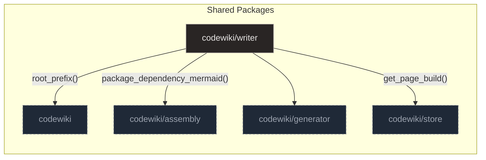

# Writer

## Purpose and Scope

The `codewiki/writer` package implements a 'plan-then-fill' documentation pipeline that replaces stochastic context retrieval with deterministic, pre-computed evidence bundles. This approach ensures that documentation generation relies on structured, pre-assembled data rather than dynamic, unpredictable context fetching.

The workflow begins with skeleton planning to define the page structure, followed by section-by-section generation using cached LLM prompts. Specific modules handle the creation of diagrams and quickstarts, ensuring that each part of the documentation is generated with precision.

A robust validation layer automatically repairs common LLM errors in diagrams and citations before final assembly. This step is critical for maintaining the integrity of the output, ensuring that technical diagrams and references are accurate and functional.

The system ensures efficiency through SHA-256 hashing for incremental builds and provides deterministic fallbacks to Jinja templates when LLM generation fails. This dual approach guarantees that documentation can be generated reliably, even in the presence of external service failures or unexpected LLM outputs.

**Sources:**
- [bundle.py:265-317](https://github.com/doxiebuilds/codewiki/blob/main/codewiki/writer/bundle.py#L265-L317)
- [write.py:281-359](https://github.com/doxiebuilds/codewiki/blob/main/codewiki/writer/write.py#L281-L359)

---

## Architecture

The `codewiki/writer` package implements a deterministic 'plan-then-fill' documentation pipeline that replaces stochastic context retrieval with pre-computed evidence bundles. This architecture is organized into a central coordinator, a data assembly layer, and specialized modules for planning, writing, and validation.

The data assembly layer is handled by `bundle.py`, which aggregates package summaries, key symbols, and dependency edges into a unified `PageBundle`. This module employs a budget-trimming mechanism to ensure the output fits within LLM token limits by iteratively removing lower-priority evidence items.

The core orchestrator in `write.py` manages the multi-step pipeline, integrating with LM Studio for LLM interactions and providing deterministic fallbacks to Jinja templates. It relies on SHA-256 hashing of content and specs to skip redundant regeneration, ensuring incremental build efficiency.

Specialized modules handle specific aspects of the generation process. `prompts.py` provides distinct template builders for planning, error recovery, diagramming, and quickstart generation to standardize LLM inputs. `gitlog.py` records git HEAD information to identify code movements, while `pointer.py` ensures the target repository's `CLAUDE.md` contains a consistent entry point for the generated wiki.

**Sources:**
- [bundle.py:1-418](https://github.com/doxiebuilds/codewiki/blob/main/codewiki/writer/bundle.py#L1-L418)
- [write.py:1-360](https://github.com/doxiebuilds/codewiki/blob/main/codewiki/writer/write.py#L1-L360)
- [prompts.py:1-181](https://github.com/doxiebuilds/codewiki/blob/main/codewiki/writer/prompts.py#L1-L181)
- [gitlog.py:1-54](https://github.com/doxiebuilds/codewiki/blob/main/codewiki/writer/gitlog.py#L1-L54)
- [pointer.py:1-47](https://github.com/doxiebuilds/codewiki/blob/main/codewiki/writer/pointer.py#L1-L47)

---

## Evidence Aggregation and Bundling

### Building the Bundle

The `build_bundle` function orchestrates the creation of a `PageBundle` by querying the database for package summaries, module symbols, and key symbols. It uses `_module_rows` to retrieve module data, prioritizing non-test files and capping test inclusion to approximately 20% of the limit unless `keep_tests` is enabled. Similarly, `_key_symbol_rows` fetches symbol and summary data, ordering by source code size and applying stable sorting to push test symbols to the end when excluded.

Once the raw data is retrieved, `_build_evidence` aggregates this metadata into a standardized list of `EvidenceItem` objects. This function processes package and module summaries, key symbols, source excerpts, and grouped edge pairs, tagging each item with a specific kind such as `pkg`, `module`, `symbol`, `excerpt`, `edges`, `table`, or `git`. For domain tables, it extracts citations via regex to ensure proper source linking, while git evidence is appended if available.

To manage output size, `trim_to_budget` ensures the `PageBundle` fits within a specified token limit by iteratively removing whole `EvidenceItems` based on a 'cheapest-loss first' priority strategy. This strategy targets excerpts, modules, symbols, and edges in specific counts, rebuilding the view after each stage. If item removal is insufficient, it falls back to truncating table rows in place to reduce token count while preserving the item's identity.

### Repairing Paths and Citations

The `relevant_edges` function queries the `edges` table to find resolved calls and channel flows that touch specific participants, matching against both full qualified names and short names. It constructs a set of normalized participant keys and filters query results using a helper function `_hit` to identify relevant interactions. The results are formatted as strings indicating direction and type, such as `A -> B (calls)` or `A -> redis[chan] (publishes)`, and are returned up to a specified limit for diagram rendering.

To ensure citation integrity, `repair_entries` processes raw source location strings by parsing them and resolving rootless paths via a prefix lookup. It clamps line ranges to actual file lengths and filters entries to ensure they fall within an allowed set of evidence locations, including a slack margin. This function removes duplicates and invalid entries, sanitizing citation data before rendering to ensure only valid, in-range, and allowed sources are kept.

**Sources:**
- [bundle.py:96-119](https://github.com/doxiebuilds/codewiki/blob/main/codewiki/writer/bundle.py#L96-L119)
- [bundle.py:122-145](https://github.com/doxiebuilds/codewiki/blob/main/codewiki/writer/bundle.py#L122-L145)
- [bundle.py:177-232](https://github.com/doxiebuilds/codewiki/blob/main/codewiki/writer/bundle.py#L177-L232)
- [bundle.py:376-417](https://github.com/doxiebuilds/codewiki/blob/main/codewiki/writer/bundle.py#L376-L417)
- [diagram.py:40-74](https://github.com/doxiebuilds/codewiki/blob/main/codewiki/writer/diagram.py#L40-L74)
- [sources.py:72-126](https://github.com/doxiebuilds/codewiki/blob/main/codewiki/writer/sources.py#L72-L126)

---

## Planning and Skeleton Generation

### Skeleton Construction

The `codewiki/writer/skeleton` module implements the initial stage of the plan-then-fill workflow, converting an evidence catalog into a structured page outline. The core orchestration is handled by `plan_page`, which constructs a user prompt from evidence and domain tables before invoking an LLM via `chat_fn` to generate a JSON plan. This plan is parsed into `Skeleton` and `SectionPlan` objects, which serve as the core data models for hierarchical content representation.

If the LLM generation fails or produces invalid output, the system degrades gracefully by invoking `fallback_skeleton`. This rule-based function groups evidence items by kind, separates test modules, and populates a predefined sequence of sections such as Purpose and Scope, Architecture, and Watch-outs. The fallback ensures deterministic ordering and consistent, LLM-free skeleton generation when the primary path is unavailable.

### Validation Gate

Validation is enforced by `validate_skeleton`, which acts as a gatekeeper to transform unvalidated input into a canonical `Skeleton` structure while enforcing strict invariants. It calls `_coerce_section` to normalize individual section data, ensuring headings are non-empty strings and evidence items are valid, deduplicated, and stripped of whitespace. The function also performs deterministic fixups, such as merging sections with insufficient evidence and ensuring a canonical 'Watch-outs' section exists at the end.

The validation process further ensures structural integrity by capping the total number of sections, pinning exactly one architecture diagram to the second section, and injecting missing reference tables. If every section lacks citable evidence, the system supplements them with the strongest module items to guarantee that sources can be synthesized. This robust validation layer automatically repairs common LLM errors before the skeleton is passed to the generation phase.

**Sources:**
- [skeleton.py:1-310](https://github.com/doxiebuilds/codewiki/blob/main/codewiki/writer/skeleton.py#L1-L310)
- [skeleton.py:113-224](https://github.com/doxiebuilds/codewiki/blob/main/codewiki/writer/skeleton.py#L113-L224)
- [skeleton.py:228-275](https://github.com/doxiebuilds/codewiki/blob/main/codewiki/writer/skeleton.py#L228-L275)
- [skeleton.py:279-309](https://github.com/doxiebuilds/codewiki/blob/main/codewiki/writer/skeleton.py#L279-L309)
- [skeleton.py:83-110](https://github.com/doxiebuilds/codewiki/blob/main/codewiki/writer/skeleton.py#L83-L110)

---

## Section and Diagram Filling

### Section Generation

The `sections.py` module implements the core 'plan-then-fill' workflow, generating individual wiki sections using Large Language Models while maintaining a byte-identical prompt prefix for effective caching. The `fill_section` function orchestrates this by constructing a prompt from a shared prefix and a section-specific tail, then invoking the LLM via `chat_fn`. It validates the output using `check_section`, retrying up to twice with error feedback if validation fails, unless truncation is detected. If all attempts fail, the system delegates to a deterministic fallback renderer to ensure robustness.

To ensure the model has all necessary constraints and source material, `section_tail` assembles a multi-part instruction block containing section metadata, conditional context like tables or diagram placeholders, and relevant evidence slices. The `write_page` function in `write.py` iterates through the skeleton sections consecutively, keeping the prompt-prefix cache hot and tracking token usage and fallback statistics for each section.

### Diagram Enforcement

The `diagram.py` module handles the generation of dynamic flow or sequence diagrams that are not derived from a static model, operating as stage 3 of the documentation pipeline. The `fill_diagram` function gathers precise structural context by filtering evidence items via `_section_participants` to identify relevant edges and participants, then constructs a prompt for the LLM to generate Mermaid syntax. It validates the LLM response against expected participants and edges, returning an empty string on any failure or validation error.

To enforce consistent visual styling, `apply_palette` post-processes the Mermaid output by removing existing styling lines, identifying nodes within subgraphs, and assigning colors from a predefined palette. Additionally, `check_and_fix_mermaid` in `validate.py` enforces strict structure on diagram blocks within the Markdown content, ensuring the first diagram matches a deterministic reference and dropping any blocks beyond the third or those containing invalid participants.

**Sources:**
- [sections.py:1-216](https://github.com/doxiebuilds/codewiki/blob/main/codewiki/writer/sections.py#L1-L216)
- [sections.py:110-144](https://github.com/doxiebuilds/codewiki/blob/main/codewiki/writer/sections.py#L110-L144)
- [sections.py:51-78](https://github.com/doxiebuilds/codewiki/blob/main/codewiki/writer/sections.py#L51-L78)
- [diagram.py:1-178](https://github.com/doxiebuilds/codewiki/blob/main/codewiki/writer/diagram.py#L1-L178)
- [diagram.py:155-177](https://github.com/doxiebuilds/codewiki/blob/main/codewiki/writer/diagram.py#L155-L177)
- [validate.py:137-170](https://github.com/doxiebuilds/codewiki/blob/main/codewiki/writer/validate.py#L137-L170)

---

## Final Assembly and Quality Assurance

### Source Citation Management

The `sources.py` module manages the lifecycle of source citations, ensuring they are mechanically valid and properly linked before final output. It begins by splitting sections to isolate 'Sources' blocks, then repairs entries by resolving paths and clamping line numbers against actual file lengths. Validated entries are rendered as GitHub blob links, with a fallback to plain text if configuration is missing. Additionally, it normalizes inline file paths in prose to maintain consistency throughout the document.

The `repair_entries` function handles the core logic for sanitizing citation data, dropping entries that point to unknown files or fall outside the section's allowed evidence ranges. It prefixes rootless paths using a configured root prefix when the target file exists, ensuring references are absolute. Line ranges are clamped to the actual file length, and duplicate entries are removed to keep the citation list clean.

The `render_sources` function formats the cleaned list of source file entries into a Markdown string containing hyperlinks to specific lines in a GitHub repository. It checks for a configured GitHub base URL; if absent, it falls back to a plain text format. When a base URL is present, it detects basename collisions among the entries to decide whether to display the full root-stripped path or just the filename, then constructs links with line anchors.

### Final Linking

It also detects near-duplicate sections using 8-gram shingle overlap and records warnings for the caller. Finally, it delegates to `linkify_page` to convert bare source tokens into clickable links, returning the processed page along with collected errors and warnings. This ensures that the final output is both structurally sound and navigable.

The `linkify_page` function processes a Markdown string line-by-line to identify and transform 'Sources' blocks that have not yet been linkified. It uses regex patterns to detect block headers and entry lines, extracts the relevant identifiers, and delegates the actual link generation to helper functions. This ensures that only valid, remaining bare tokens are converted into GitHub links.

The `validate.py` module serves as the final quality gate, orchestrating three sequential repair stages: Mermaid diagram sanitization, citation repair, and structural checking. It utilizes specialized helper functions to enforce strict schemas, such as ensuring Mermaid diagrams use known participants and citations reference valid file locations. Validation outcomes are encapsulated in `ValidationReport` and `SectionReport` classes, which separate blocking errors from non-blocking warnings and track repair actions.

The `check_section` function validates individual Markdown sections by enforcing structural rules, such as heading format and balanced code fences. It processes the section's evidence slice by repairing source entries, synthesizing missing sources from the allowed set if necessary, and stripping inline file paths. This ensures sections meet quality and formatting standards before finalization.

The `repair_citations` function acts as a sanitization layer for architectural citations, ensuring they reference valid, existing locations within the codebase. It prefixes rootless paths using a configured root prefix if the target file exists, then iterates through all citations to drop those pointing to unknown files. It also clamps line ranges that exceed file lengths or strips line numbers for files with unknown sizes.

| Event type | Source |
|---|---|
| `architecture` | `codewiki/writer/prompts.py:41` |
| `flow` | `codewiki/writer/prompts.py:41` |
| `sequence` | `codewiki/writer/prompts.py:42` |

**Sources:**
- [sections.py:165-215](https://github.com/doxiebuilds/codewiki/blob/main/codewiki/writer/sections.py#L165-L215)
- [sources.py:1-223](https://github.com/doxiebuilds/codewiki/blob/main/codewiki/writer/sources.py#L1-L223)
- [sources.py:137-162](https://github.com/doxiebuilds/codewiki/blob/main/codewiki/writer/sources.py#L137-L162)
- [sources.py:194-222](https://github.com/doxiebuilds/codewiki/blob/main/codewiki/writer/sources.py#L194-L222)
- [validate.py:1-432](https://github.com/doxiebuilds/codewiki/blob/main/codewiki/writer/validate.py#L1-L432)
- [validate.py:66-111](https://github.com/doxiebuilds/codewiki/blob/main/codewiki/writer/validate.py#L66-L111)

---

## Where to Start & Watch-Outs

### Entry Points and Pipeline Stages

The primary entry point for documentation generation is `write_page`, which orchestrates a multi-stage pipeline including skeleton planning, section filling, diagram generation, and final assembly. This function enforces token budgets and handles LLM transport failures by falling back to Jinja templates, ensuring robustness during incremental builds. For generating a 'Quickstart' entry, developers should use `write_quickstart`, which compiles a table of provided pages and generates an introductory summary via LLM or a hardcoded fallback.

### Critical Constraints and Validation

Developers must adhere to strict grammar and grounding policies for LLM-generated Mermaid diagrams, as enforced by `check_llm_mermaid_block`. This validator ensures diagrams use supported headers, balanced subgraphs, and specific edge labeling formats, while checking that unknown node labels do not exceed a 30% threshold relative to known participants. Additionally, path normalization is handled by `strip_inline_paths`, which extracts only the basename of file paths and wraps them in backticks to maintain consistent formatting in documentation sections.

### Test-Specific Behaviors and Events

The system supports specific WebSocket events for monitoring the generation process, including `architecture`, `flow`, and `sequence` events defined in the prompts module. These events allow developers to track the progress and structure of the documentation pipeline in real-time. The validation layer also includes tests for diagram generation and citation repair, ensuring that generated content remains structurally sound and semantically consistent with the provided context.

### Source Evidence

**Sources:**
- [write.py:104-200](https://github.com/doxiebuilds/codewiki/blob/main/codewiki/writer/write.py#L104-L200)
- [write.py:233-277](https://github.com/doxiebuilds/codewiki/blob/main/codewiki/writer/write.py#L233-L277)
- [validate.py:309-408](https://github.com/doxiebuilds/codewiki/blob/main/codewiki/writer/validate.py#L309-L408)
- [sources.py:166-190](https://github.com/doxiebuilds/codewiki/blob/main/codewiki/writer/sources.py#L166-L190)
- [prompts.py:41](https://github.com/doxiebuilds/codewiki/blob/main/codewiki/writer/prompts.py#L41)
- [prompts.py:42](https://github.com/doxiebuilds/codewiki/blob/main/codewiki/writer/prompts.py#L42)